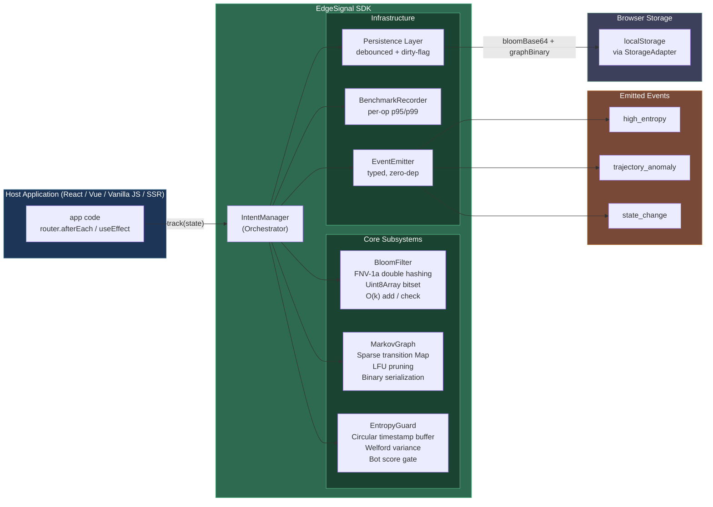
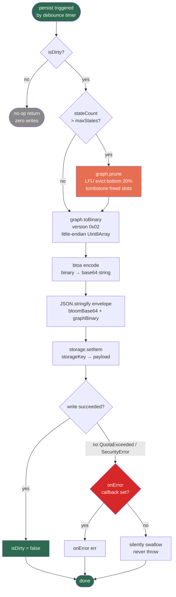

# EdgeSignal — Documentation

> **EdgeSignal** — privacy-first, on-device behavioral intent modeling with zero data egress. No server. No consent banner. No GDPR exposure.

[](https://github.com/purushpsm147/EdgeSignal-Privacy-First-Intent-Engine)
[](./LICENSE)
[](https://www.typescriptlang.org/)
[](https://github.com/purushpsm147/EdgeSignal-Privacy-First-Intent-Engine#privacy--gdpr-compliance)
[](https://github.com/purushpsm147/EdgeSignal-Privacy-First-Intent-Engine#privacy--gdpr-compliance)

A tiny, tree-shakeable TypeScript SDK that learns how a user navigates your application and fires events when behavior becomes anomalous — all without sending a single byte to a server. It works in browsers, Node.js, Deno, Bun, Edge Workers, and SSR frameworks.

**The core privacy guarantee:** EdgeSignal processes no personal data. It never observes who the user is — only the anonymous sequence of state labels your application explicitly provides. Because no personal data ever leaves the device, EdgeSignal falls outside the primary scope of GDPR data processing obligations and requires no consent banner, no cookie notice, no Data Processing Agreement, and no server-side data deletion workflow.

---

## Table of Contents

1. [What It Is](#what-it-is)
2. [Strengths](#strengths)
3. [Known Limitations](#known-limitations)
4. [Installation](#installation)
5. [Quick Start](#quick-start)
6. [Real-World Recipes](#real-world-recipes)
   - [Dynamic Paywall](#1-dynamic-paywall)
   - [Hesitation Discount](#2-hesitation-discount)
   - [Rage-Click Healer](#3-rage-click-healer)
   - [GA4 Bridge — Proving ROI Without Sending Behavioral Data](#4-ga4-bridge--proving-roi-without-sending-behavioral-data)
   - [A/B Testing Holdout — Measuring ROI Without a Server](#5-ab-testing-holdout--measuring-roi-without-a-server)
7. [Configuration Reference](#configuration-reference)
8. [Testing Guide](#testing-guide)
9. [Technical Deep Dive](#technical-deep-dive)
   - [Architecture Overview](#architecture-overview)
   - [Bloom Filter](#bloom-filter)
   - [Markov Graph](#markov-graph)
   - [Transition Entropy](#transition-entropy)
   - [Log-Likelihood Trajectory Analysis](#log-likelihood-trajectory-analysis)
   - [Z-Score Anomaly Gate](#z-score-anomaly-gate)
   - [EntropyGuard — Bot & Anti-Gaming Protection](#entropyguard--bot--anti-gaming-protection)
   - [Dwell-Time Anomaly Detection](#dwell-time-anomaly-detection)
   - [Tab-Visibility Dwell-Time Correction](#tab-visibility-dwell-time-correction)
   - [Baseline Drift Auto-Killswitch](#baseline-drift-auto-killswitch)
   - [Selective Bigram Markov Transitions](#selective-bigram-markov-transitions)
   - [Event Cooldown](#event-cooldown)
   - [IntentManager Orchestration](#intentmanager-orchestration)
   - [Deterministic Counter API](#deterministic-counter-api)
   - [Route State Normalizer](#route-state-normalizer)
   - [A/B Testing Holdout](#ab-testing-holdout)
   - [Binary Serialization](#binary-serialization)
   - [LFU Pruning](#lfu-pruning)
10. [Performance](#performance)
11. [Bundle Size](#bundle-size)
12. [Privacy & GDPR Compliance](#privacy--gdpr-compliance)
   - [Verified Privacy Claims](#verified-privacy-claims)
   - [GDPR Article Mapping](#gdpr-article-mapping)
   - [No Consent Required](#no-consent-required)
   - [CCPA / ePrivacy](#ccpa--eprivacy)
   - [EdgeSignal vs. Traditional Analytics](#edgesignal-vs-traditional-analytics)
13. [License](#license)

---

## What It Is

The EdgeSignal SDK is a **local behavioral inference library**. As a user navigates your application, it:

1. Records state transitions (page routes, UI milestones, custom events) into a sparse **Markov graph** stored in `localStorage`.
2. Maintains a **Bloom filter** for O(1) membership tests ("has this user ever visited `/checkout`?").
3. Continuously evaluates **transition entropy** — when a user starts wandering randomly (e.g. rage-clicking back and forth), a `high_entropy` event fires.
4. Compares the live navigation trajectory against a **calibrated baseline graph** via log-likelihood scoring. Unusual paths trigger a `trajectory_anomaly` event.
5. Runs **EntropyGuard**, a timing-based bot detector, to suppress false signals from automated test runners and scrapers.
6. Tracks **dwell-time** per state and fires a `dwell_time_anomaly` event when the time spent deviates statistically from learned patterns (Welford’s online z-score, O(1) per call). Pauses the dwell timer automatically when the tab is hidden, preventing false hesitation signals from tab switching.
7. Optionally learns **selective bigram transitions** (`A→B` → `B→C`) for richer second-order behavioral modeling, frequency-gated to prevent state explosion.
8. Protects against **baseline drift** with a rolling-window killswitch — if `trajectory_anomaly` fires too frequently (indicating the baseline no longer reflects user behaviour), trajectory evaluation is silently disabled to prevent false positives.
9. Auto-normalizes URL strings passed to `track()` via a built-in **route normalizer**: query strings, hash fragments, trailing slashes, UUIDs, and MongoDB ObjectIDs are stripped so the engine always receives a stable canonical state label.
10. Provides a **deterministic counter API** (`incrementCounter` / `getCounter` / `resetCounter`) for exact business metrics (e.g. “articles read”) that must not tolerate Bloom filter false positives.
11. Supports **A/B testing holdout** — randomly assigns each session to `treatment` or `control` at construction time. Control sessions perform all inference and increment telemetry counters but suppress behavioral events, enabling conversion-lift measurement with zero server-side infrastructure.

All of this happens inside the user’s browser. No analytics endpoint. No fingerprinting. No PII.

---

## Strengths

| Property | Detail |
|---|---|
| **Zero data egress** | Every computation runs on the device. Nothing leaves the browser. |
| **Tiny footprint** | Minified bundle ≈ 6 kB gzip. Bloom filter default: 256 bytes. Serialized graph: ~1.4 kB for 100 states. |
| **Sub-millisecond hot path** | `track()` averages **0.0019 ms** at steady state (p99 < 0.005 ms). |
| **SSR-safe** | All browser globals are behind `StorageAdapter` / `TimerAdapter` interfaces. Works in Next.js, Nuxt, Remix, and Cloudflare Workers without a `typeof window` guard. |
| **Isomorphic adapters** | Ship your own storage and timer implementations for testing, Redis, or any other backing store. |
| **Dirty-flag persistence** | `localStorage` writes only happen when state actually changed, eliminating jank on high-frequency routes. |
| **Bounded memory growth** | LFU pruning evicts the least-used 20 % of states when the graph exceeds `maxStates` (default: 500). |
| **Bot-resilient** | EntropyGuard detects impossibly-fast timing patterns and silently suppresses entropy/trajectory events for suspected bots, preventing discount abuse. |
| **Dwell-time anomaly** | O(1) Welford’s online z-score per state — fires `dwell_time_anomaly` when a user lingers or rushes through a page anomalously. |
| **Selective bigrams** | Optional second-order Markov transitions, frequency-gated and LFU-pruned. Only 18 bytes additional graph overhead at 50 states. |
| **Event cooldown** | Per-channel cooldown gating (`eventCooldownMs`) prevents event flooding without losing detection fidelity. |
| **Tab-visibility correction** | Dwell timer is automatically paused while `document.hidden === true`. Tabs switched away for 30 seconds do not produce a 30-second dwell reading. No configuration required. |
| **Drift auto-killswitch** | A rolling-window guard monitors the `trajectory_anomaly`/`track()` ratio. When it exceeds `driftProtection.maxAnomalyRate`, trajectory evaluation is silently disabled so a stale baseline can never flood your UI with false positives. `getTelemetry().baselineStatus` reflects `'drifted'` when the killswitch has engaged. |
| **Deterministic counters** | `incrementCounter(key)` / `getCounter(key)` / `resetCounter(key)` — exact integer counters, zero false positives, session-scoped. Use for business metrics like “articles read” where the Bloom filter’s probabilistic nature is unacceptable. |
| **Route normalization** | `track()` auto-normalizes raw URLs: strips `?query`, `#hash`, trailing slashes, and replaces UUIDs / MongoDB ObjectIDs with `:id`. Pass `window.location.href` directly — the engine always receives a stable state label. |
| **A/B holdout** | `holdoutConfig: { percentage: 10 }` routes ~10 % of sessions to a `control` group. Control sessions run all inference and increment `anomaliesFired` identically to treatment but suppress behavioral event emissions, giving you clean conversion-lift data with zero server-side tracking. |
| **Clean teardown** | `destroy()` API flushes state, cancels timers, and removes listeners for leak-free SPA lifecycle management. |
| **Fully typed** | Ships `.d.ts` declarations for every public API and event payload. |
| **Dual CJS + ESM** | `dist/index.js` (ESM) + `dist/index.cjs` (CommonJS) with source maps. |
| **Zero runtime deps** | The entire package has no external runtime dependencies. |

---

## Known Limitations

These are accepted, documented constraints — not bugs.

### 1. AUC ≈ 0.74 at low noise deltas

When the difference between a "normal" and "anomalous" trajectory is very small (Δε ≤ 0.05 noise, entropy difference < 0.05 nats), the z-score distributions of the two populations overlap substantially. This yields an AUC of approximately **0.74 at the optimal operating point**.

This is a **fundamental signal constraint**, not a tuning problem. A single-window 32-step average log-likelihood cannot fully separate distributions that close. There are two paths to improvement:

- **Longer observation windows** (> 32 steps), or
- **Richer feature space** — dwell-time anomaly detection is now built in (see [Dwell-Time Anomaly Detection](#dwell-time-anomaly-detection)). Click velocity and inter-event interval entropy remain as future enhancements (see [FUTURE_FEATURES.md](./FUTURE_FEATURES.md)).

For most product use cases (discount triggers, paywall decisions, support-chat prompts) the 0.74 AUC is sufficient. Do not use this library as the sole input in high-stakes security decisions.

### 2. Bloom filter false positives

The Bloom filter never returns false negatives, but can return false positives — it may occasionally report `hasSeen('/checkout') === true` for a state the user has not actually visited. The default configuration (2048 bits, 4 hash functions) yields a false-positive rate under 1 % for up to ~200 distinct states. Use `BloomFilter.computeOptimal(n, fpr)` to tune for your application's state count.

### 3. `localStorage` quota limits

`persist()` writes to `localStorage`. Browsers allow 5–10 MB per origin. The library's binary format keeps the payload to ~1.4 kB for 100 states, but extremely large graphs (thousands of states) can hit quota limits. Subscribe to `onError` to handle `QuotaExceededError` gracefully.

### 4. No cross-tab synchronization

The in-memory graph is not kept in sync across browser tabs. Each tab maintains its own learned state. If your application needs a unified model, flush the state server-side and provide it as a `baseline` config on initialization.

### 5. Quantization rounding

Transition probabilities stored in the binary format are quantized to 8-bit precision (`uint8`, 256 levels). The maximum rounding error per probability is ±1/255 ≈ ±0.004. This is negligible for all practical thresholds.

---

## Installation

```bash
npm install edge-signal
```

```bash
pnpm add edge-signal
```

```bash
yarn add edge-signal
```

The package ships **zero runtime dependencies**.

---

## Quick Start

```ts
import { IntentManager } from 'edge-signal';

const intent = new IntentManager({
  storageKey: 'my-app-intent',   // localStorage key
  graph: {
    highEntropyThreshold: 0.75,  // normalized entropy in [0..1]
    divergenceThreshold: 3.5,    // z-score magnitude to trigger anomaly
    maxStates: 500,              // LFU prune limit
  },
});

// Subscribe to events before tracking
intent.on('high_entropy', ({ state, normalizedEntropy }) => {
  console.log(`User is wandering at "${state}" (entropy=${normalizedEntropy.toFixed(2)})`);
});

intent.on('trajectory_anomaly', ({ zScore, expectedBaselineLogLikelihood }) => {
  console.log(`Unusual path detected (z=${zScore.toFixed(2)})`);
});

intent.on('state_change', ({ from, to }) => {
  console.log(`${from ?? 'start'} → ${to}`);
});

// Call track() on every route change or significant UI event
intent.track('/home');
intent.track('/products');
intent.track('/products/42');
intent.track('/cart');
```

### Event Payloads

```ts
// Fires when normalized entropy >= highEntropyThreshold for a state
interface HighEntropyPayload {
  state: string;
  entropy: number;           // raw Shannon entropy in nats
  normalizedEntropy: number; // [0..1], 1.0 = maximum randomness
}

// Fires when the trajectory log-likelihood diverges from baseline
interface TrajectoryAnomalyPayload {
  stateFrom: string;
  stateTo: string;
  realLogLikelihood: number;             // LL under the live graph
  expectedBaselineLogLikelihood: number; // LL under the baseline graph
  zScore: number;                        // standard deviations from baseline mean
}

// Fires when dwell time on a state deviates from the learned mean
interface DwellTimeAnomalyPayload {
  state: string;        // the state where anomalous dwell was observed
  dwellMs: number;      // actual dwell time in milliseconds
  meanMs: number;       // learned mean dwell for this state
  stdMs: number;        // learned standard deviation
  zScore: number;       // (dwellMs - mean) / std
}

// Fires on every track() call
interface StateChangePayload {
  from: string | null; // null on the first track() call
  to: string;
}

// Fired by intent.trackConversion() — application-controlled
interface ConversionPayload {
  type: string;       // e.g. 'purchase', 'signup', 'trial_start'
  value?: number;     // optional monetary value
  currency?: string;  // ISO 4217 code, e.g. 'USD'
}

// Returned by intent.getTelemetry() — aggregate counters only, no raw data
interface EdgeSignalTelemetry {
  sessionId: string;                                        // local UUID, never transmitted
  transitionsEvaluated: number;                            // total track() calls with a prior state
  botStatus: 'human' | 'suspected_bot';                   // current EntropyGuard classification
  anomaliesFired: number;                                  // sum of high_entropy + trajectory_anomaly + dwell_time_anomaly
  engineHealth: 'healthy' | 'pruning_active' | 'quota_exceeded'; // storage health
}
```

---

## Real-World Recipes

### 1. Dynamic Paywall

Show a soft paywall only after a user has demonstrated genuine reading intent — not on their first visit.

```ts
import { IntentManager } from 'edge-signal';

const intent = new IntentManager({ storageKey: 'editorial-intent' });

function onRouteChange(route: string) {
  intent.track(route);

  // Fire paywall after the user has visited 3+ distinct article pages.
  // hasSeen() is O(1) regardless of how many states exist.
  const articleRoutes = ['/article/1', '/article/2', '/article/3'];
  const seenCount = articleRoutes.filter(r => intent.hasSeen(r)).length;

  if (seenCount >= 3 && !intent.hasSeen('/paywall-shown')) {
    intent.track('/paywall-shown'); // Bloom filter prevents re-showing across sessions
    showPaywall();
  }
}
```

**Why this works:**

`hasSeen()` is backed by the Bloom filter — it is an O(1) constant-time operation regardless of how many states the graph has learned. The filter is persisted across sessions via `localStorage`, so a user who reads 2 articles today and 1 tomorrow still hits the gate. The `/paywall-shown` sentinel state ensures the paywall appears at most once per device, with no server-side session required.

---

### 2. Hesitation Discount

> **TL;DR for simple integrations:** If you just want to show a discount when hesitation is detected, listen to `hesitation_detected` — the SDK handles the dual-signal correlation internally. The full recipe below is for power users who need access to the raw `zScore` values or custom window logic.

Detect genuine purchase hesitation by correlating two independent signals:

- **Spatial signal** (`trajectory_anomaly`) — the user's path diverges from how typical converters navigate.
- **Temporal signal** (`dwell_time_anomaly`) — the user is lingering statistically longer than their own previous visits to that state.

A single signal is a weak proxy. Both firing **within the same short window** is a high-confidence indicator of "I want to buy but I'm not sure." This is the same multi-signal correlation approach used in UEBA and SIEM tooling to reduce false positives.

```ts
import { IntentManager, SerializedMarkovGraph } from 'edge-signal';

// Calibrated baseline: what a converting session looks like.
// Gather this from historical analytics, then embed it here.
const checkoutBaseline: SerializedMarkovGraph = {
  states: ['/home', '/search', '/product', '/cart', '/checkout'],
  rows: [
    [0, 100, [[1, 80], [2, 20]]],     // /home → mostly /search
    [1, 80,  [[2, 75], [0, 5]]],      // /search → /product
    [2, 75,  [[3, 60], [1, 15]]],     // /product → /cart
    [3, 60,  [[4, 55], [2, 5]]],      // /cart → /checkout
  ],
  freedIndices: [],
};

const intent = new IntentManager({
  storageKey: 'shop-intent',
  baseline: checkoutBaseline,
  graph: {
    divergenceThreshold: 2.5,
    // Calibrated from your own data using scripts/scenario-matrix.mjs
    baselineMeanLL: -0.52,
    baselineStdLL: 0.18,
  },
  // Enable temporal intent detection
  dwellTime: {
    enabled: true,
    minSamples: 5,          // learn quickly within a session
    zScoreThreshold: 2.0,   // lower individual threshold — the combo gate does the heavy lifting
  },
  eventCooldownMs: 15_000,  // prevent re-triggering within 15 s at the SDK level
});

// Time-bound correlation: both signals must fire within 30 seconds of each other.
// Without this window, a trajectory anomaly on /home could pair with a dwell
// anomaly on /terms-of-service ten minutes later — a spurious combination.
let lastTrajectoryAnomaly = 0;
let lastDwellAnomaly = 0;
const CORRELATION_WINDOW_MS = 30_000; // 30 seconds

function maybeShowDiscount(): void {
  const now = Date.now();
  const isCorrelated =
    (now - lastTrajectoryAnomaly < CORRELATION_WINDOW_MS) &&
    (now - lastDwellAnomaly < CORRELATION_WINDOW_MS);

  if (isCorrelated && isNearCheckout()) {
    showHesitationDiscount('10% off — just for you. Offer expires in 10 min.');
    // Reset timestamps to prevent spamming after the discount is shown
    lastTrajectoryAnomaly = 0;
    lastDwellAnomaly = 0;
  }
}

intent.on('trajectory_anomaly', () => {
  lastTrajectoryAnomaly = Date.now();
  maybeShowDiscount();
});

intent.on('dwell_time_anomaly', ({ zScore }) => {
  // Only positive z-scores mean lingering; negative means rushing through.
  // Use a slightly relaxed threshold here (1.5) since the correlation window
  // already filters coincidental pairings.
  if (zScore > 1.5) {
    lastDwellAnomaly = Date.now();
    maybeShowDiscount();
  }
});

function isNearCheckout(): boolean {
  return intent.hasSeen('/cart') || intent.hasSeen('/checkout');
}
```

**Calibrating the baseline:**

Run `npm run test:perf:matrix` after pointing `scripts/scenario-matrix.mjs` at representative session replays from your analytics platform. It outputs the `baselineMeanLL` and `baselineStdLL` values to embed in your config.

**Why dwell-time stats are session-scoped — a privacy feature, not a limitation:**

Dwell-time statistics are held in memory only and are never persisted to `localStorage`. This is a deliberate privacy boundary. Permanently storing per-user temporal profiles (how long someone reads each page, across every visit, over months) would enable invasive behavioral fingerprinting — correlating reading speed and attention patterns to build a persistent identity. EdgeSignal intentionally keeps all temporal math strictly session-scoped. The warm-up period (`minSamples`) resets on every page load as a direct consequence of this guarantee. For checkout funnels this trade-off is acceptable, and arguably beneficial: the signal is always grounded in the current session's behaviour, not stale historical data from a different context.

**GDPR note:** Traditional hesitation-detection solutions — heatmap tools, session replay platforms, A/B testing SDKs — stream interaction data to third-party servers, triggering GDPR Article 6 lawful-basis requirements, consent obligations under ePrivacy, and third-party processor agreements. This recipe achieves the same commercial outcome (discount trigger) with **zero data egress**. Nothing collected here is personal data under GDPR Article 4(1). No consent banner is required. No cookie notice applies. The entire inference lives and dies inside the user's browser tab.

---

### 3. Rage-Click Healer

Detect frantic, high-entropy navigation and surface a help prompt before the user bounces.

```ts
import { IntentManager } from 'edge-signal';

const intent = new IntentManager({
  storageKey: 'support-intent',
  graph: {
    highEntropyThreshold: 0.80, // trigger earlier for support use case
  },
});

intent.on('high_entropy', ({ state, normalizedEntropy }) => {
  if (normalizedEntropy > 0.90) {
    // Full rage-click pattern: open live chat immediately
    openLiveChat({ context: `User stuck at: ${state}` });
  } else {
    // Moderate confusion: surface a contextual tooltip or FAQ
    showContextualHelp(state);
  }
});

// Track every page view — works with any router
router.afterEach((to) => intent.track(to.path));

// Or in React
useEffect(() => {
  intent.track(location.pathname);
}, [location.pathname]);
```

---

### 4. GA4 Bridge — Proving ROI Without Sending Behavioral Data

This recipe shows how to connect EdgeSignal's local event bus to Google Analytics 4 so you can measure bot mitigation, hesitation interventions, and assisted conversions — all **without sending any behavioral or personally identifiable data to GA4**.

> **Event name reference**
>
> | What you want to detect | Simple API | Low-level (power users) |
> |---|---|---|
> | Bot traffic intercepted | `bot_detected` ✅ | `high_entropy` + `getTelemetry().botStatus` guard |
> | User hesitation detected | `hesitation_detected` ✅ | `trajectory_anomaly` + `dwell_time_anomaly` dual-signal |
> | Conversion completed | `trackConversion()` / `conversion` | same |

```ts
import { IntentManager } from 'edge-signal';

const intent = new IntentManager({
  storageKey: 'shop-intent',
  botProtection: true,
  dwellTime: { enabled: true, minSamples: 5, zScoreThreshold: 2.0 },
  eventCooldownMs: 15_000,
  hesitationCorrelationWindowMs: 30_000, // both signals must fire within 30 s
});

// ─── 1. Bot Mitigation — Proves server-cost / fraud savings ───────────────────
//
// bot_detected fires on the false→true transition of EntropyGuard's bot
// classification. No boilerplate guard needed.
intent.on('bot_detected', ({ state }) => {
  // GA4 receives a dimensionless aggregate count — no PII, no behavioral data.
  window.gtag('event', 'edgesignal_bot_mitigated', {
    event_category: 'security',
  });
  // Optionally gate the checkout flow here to prevent fraud.
});

// ─── 2. Hesitation Intervention — Proves conversion-rate ROI ──────────────────
//
// hesitation_detected fires when trajectory_anomaly (spatial) AND
// dwell_time_anomaly with positive z-score (temporal) both fire within
// hesitationCorrelationWindowMs. The SDK handles the correlation window
// internally — no timestamp boilerplate required.
intent.on('hesitation_detected', ({ state, dwellZScore }) => {
  // Show the user a discount UI
  showDiscountModal();

  // Tell GA4 that EdgeSignal triggered an intervention.
  window.gtag('event', 'edgesignal_intervention_triggered', {
    intervention_type: '10_percent_discount',
  });
});

// ─── 3. Close the Loop — Assisted-conversion attribution ─────────────────────
//
// Call this from your checkout success handler.
function onCheckoutComplete(orderTotal: number): void {
  // Record the conversion inside EdgeSignal's local event bus.
  intent.trackConversion({ type: 'purchase', value: orderTotal, currency: 'USD' });

  // Poll the telemetry snapshot to see whether EdgeSignal contributed.
  // getTelemetry() returns an in-memory object — no network call, no PII.
  const { anomaliesFired, sessionId } = intent.getTelemetry();

  if (anomaliesFired > 0) {
    // At least one hesitation or entropy signal fired this session —
    // EdgeSignal likely influenced the outcome.
    window.gtag('event', 'edgesignal_assisted_conversion', {
      value: orderTotal,
      // sessionId is a page-load-scoped random UUID — safe to log as a
      // correlation key because it is never stored, never transmitted by the
      // SDK itself, and expires when the tab closes.
      session_correlation_id: sessionId,
    });
  } else {
    // Conversion happened without any anomaly signal — organic buy.
    window.gtag('event', 'edgesignal_organic_conversion', {
      value: orderTotal,
    });
  }
}
```

**What GA4 receives — and what it does NOT receive:**

| Data sent to GA4 | Contains PII? | Contains behavioral data? |
|---|---|---|
| `edgesignal_bot_mitigated` event name + category | No | No — a count signal only |
| `edgesignal_intervention_triggered` + `intervention_type` | No | No — an enum label, not a path sequence |
| `edgesignal_assisted_conversion` + `value` | No | No — a purchase value you already send to GA4 for revenue reporting |
| `session_correlation_id` (random UUID) | No — not linkable to identity | No |

The Markov graph, Bloom filter, transition sequences, dwell-time measurements, entropy scores, and raw event payloads **never leave the device**. GA4 only sees dimensionless count signals that tell you whether EdgeSignal worked — not _how_ it worked or _who_ it worked on.

**GDPR standing of this pattern:**

EdgeSignal itself has no GDPR obligations (zero personal data). Sending the events above to GA4 does not create new obligations beyond those you already have for using GA4, because none of the values are personal data. You should still ensure GA4 is configured with IP anonymisation enabled and that your privacy policy references GA4 as a measurement processor, but that obligation exists independently of EdgeSignal.

---

### 5. A/B Testing Holdout — Measuring ROI Without a Server

Prove that your behavioral interventions (hesitation discounts, dynamic paywalls, support-chat prompts) actually increase conversions — without a server-side experiment platform, without a consent banner, and without sending any user data anywhere.

**How the holdout works:**

Set `holdoutConfig.percentage` to the percentage of sessions you want in the **control** group (i.e. sessions that do NOT receive the intervention). ~90 % of sessions will receive the intervention (`'treatment'`); ~10 % will not (`'control'`). Both groups perform identical behavioral inference — only the intervention UI code is gated behind `assignmentGroup`.

```ts
import { IntentManager } from 'edge-signal';

const intent = new IntentManager({
  storageKey: 'my-ab-test',
  holdoutConfig: { percentage: 10 }, // ~10% → control (no intervention)
  dwellTime: { enabled: true, minSamples: 8, zScoreThreshold: 2.0 },
  hesitationCorrelationWindowMs: 30_000,
});

// --- Intervention: fires only for TREATMENT sessions ---
intent.on('hesitation_detected', ({ state }) => {
  // getTelemetry().assignmentGroup is always 'treatment' here,
  // because control sessions never emit hesitation_detected.
  showDiscount({ page: state, discount: '10%' });
});

// --- Conversion tracking ---
// Wire up BEFORE any user action, BEFORE calling track().
intent.on('conversion', (payload) => {
  const { assignmentGroup, sessionId, anomaliesFired } = intent.getTelemetry();

  // Forward to your own analytics (GA4, Amplitude, Mixpanel, …)
  // Nothing here is personal data. No consent is required.
  myAnalytics.send({
    event: 'purchase',
    ...payload,
    assignmentGroup,  // 'treatment' | 'control'
    anomaliesFired,   // how many behavioral signals fired
    sessionId,        // local ephemeral ID — you control whether to send it
  });
});

// --- Track navigation ---
function onRouteChange(url) {
  intent.track(url); // normalizeRouteState() is applied automatically
}

// --- Record the conversion after checkout ---
function onPurchaseComplete(order) {
  intent.trackConversion({ type: 'purchase', value: order.total, currency: order.currency });
}
```

**Analyzing the lift:**

Aggregate conversion data from your analytics backend, split by `assignmentGroup`:

```
treatment CVR = conversions_treatment / sessions_treatment
control CVR   = conversions_control   / sessions_control

absolute lift = treatment_CVR - control_CVR
relative lift = absolute_lift / control_CVR × 100%
```

Because both groups perform identical inference, you can also compare `anomaliesFired` distributions to confirm the populations received equivalent behavioral signals — validating that the only difference between groups is the intervention itself.

**Using exact counters for richer lift data:**

Combine the holdout with `incrementCounter` for a more precise signal than binary conversion:

```ts
intent.on('state_change', ({ to }) => {
  if (to.startsWith('/article/')) {
    intent.incrementCounter('articles_read');
  }
  if (to === '/checkout') {
    intent.incrementCounter('checkout_visits');
  }
});

intent.on('conversion', () => {
  const { assignmentGroup } = intent.getTelemetry();
  myAnalytics.send({
    event: 'purchase',
    assignmentGroup,
    articles_read:     intent.getCounter('articles_read'),
    checkout_visits:   intent.getCounter('checkout_visits'),
  });
});
```

**Privacy note:** The holdout is entirely on-device. The `assignmentGroup` value is a single-bit flag (`'treatment'` or `'control'`) that you only transmit if your `conversion` listener explicitly sends it. EdgeSignal never sends it — or anything else — on its own.

---

## Configuration Reference

```ts
interface IntentManagerConfig {
  // Key written to the StorageAdapter (default: 'edge-signal')
  storageKey?: string;

  // Milliseconds between storage writes (default: 2000)
  persistDebounceMs?: number;

  // Bloom filter sizing
  bloom?: {
    bitSize?: number;    // default: 2048  (256 bytes)
    hashCount?: number;  // default: 4
  };

  // Markov graph behavior
  graph?: {
    highEntropyThreshold?: number;  // [0..1], default: 0.75
    divergenceThreshold?: number;   // z-score magnitude, default: 3.5
    baselineMeanLL?: number;        // calibrated mean avg log-likelihood
    baselineStdLL?: number;         // calibrated std dev of avg log-likelihood
    smoothingEpsilon?: number;      // Laplace epsilon, default: 0.01
    maxStates?: number;             // LFU prune cap, default: 500
  };

  // Pre-built reference graph for trajectory comparison
  baseline?: SerializedMarkovGraph;

  // Isomorphic adapters — swap out for SSR / testing
  storage?: StorageAdapter;  // default: BrowserStorageAdapter
  timer?: TimerAdapter;      // default: BrowserTimerAdapter

  // Called on QuotaExceededError / SecurityError during persist()
  onError?: (err: Error) => void;

  // EntropyGuard bot detection (default: true)
  // Set to false in Cypress / Playwright E2E environments
  botProtection?: boolean;

  // Minimum milliseconds between repeated emissions of the same event type.
  // Default: 0 (no cooldown). Set to e.g. 3000 to suppress event flooding.
  eventCooldownMs?: number;

  // Time window (ms) within which both trajectory_anomaly and a positive
  // dwell_time_anomaly must fire to emit hesitation_detected.
  // Default: 30_000 (30 seconds).
  hesitationCorrelationWindowMs?: number;

  // Dwell-time anomaly detection settings
  // NOTE: dwell-time accumulators are session-scoped and not persisted.
  // The learning phase restarts on every page reload / new IntentManager instance.
  dwellTime?: {
    enabled?: boolean;          // default: false
    minSamples?: number;        // minimum observations before firing (default: 10)
                                // raise this value for short-session applications
    zScoreThreshold?: number;   // |z| >= this fires the event (default: 2.5)
  };

  // Selective bigram (second-order) Markov transitions
  enableBigrams?: boolean;          // default: false
  bigramFrequencyThreshold?: number; // min unigram rowTotal before recording bigrams (default: 5)

  // Auto-killswitch: disable trajectory evaluation if the anomaly/track() ratio
  // exceeds maxAnomalyRate within a rolling evaluationWindowMs window.
  // Default: { maxAnomalyRate: 0.4, evaluationWindowMs: 300_000 }
  // Set maxAnomalyRate: 1 to effectively disable the killswitch.
  driftProtection?: {
    maxAnomalyRate: number;       // 0–1; e.g. 0.4 = 40 % of track() calls
    evaluationWindowMs: number;   // rolling window length, e.g. 300_000 (5 min)
  };

  // A/B holdout: randomly assign each session to 'treatment' or 'control'.
  // 'control' sessions run all inference and increment telemetry counters but
  // do NOT emit high_entropy, trajectory_anomaly, dwell_time_anomaly, or
  // hesitation_detected events — ideal for measuring conversion lift locally.
  // percentage is clamped to [0, 100]. Default: no holdout (all treatment).
  holdoutConfig?: {
    percentage: number; // probability (0–100) of being placed in control
  };

  // Built-in performance instrumentation
  benchmark?: {
    enabled?: boolean;       // default: false
    maxSamples?: number;     // default: 4096
  };
}
```

### Bloom Filter Tuning

Use the static helper to compute optimal parameters for your known state-space:

```ts
import { BloomFilter } from 'edge-signal';

const { bitSize, hashCount } = BloomFilter.computeOptimal(
  200,   // expected distinct states
  0.01,  // target false-positive rate (1 %)
);
// → { bitSize: 1918, hashCount: 7 }

const intent = new IntentManager({ bloom: { bitSize, hashCount } });

// Estimate current FPR after N insertions
const filter = new BloomFilter({ bitSize, hashCount });
filter.estimateCurrentFPR(150); // → ~0.004 (0.4 %)
```

### Custom Adapters (SSR / Testing)

```ts
import {
  IntentManager,
  MemoryStorageAdapter,
} from 'edge-signal';

// Server-side rendering — no localStorage access, no persistence
const intent = new IntentManager({
  storage: new MemoryStorageAdapter(),
  botProtection: false,
});

// Controllable clock for deterministic timing tests
class FakeTimerAdapter {
  private _now = 1000;
  tick(ms: number) { this._now += ms; }
  now() { return this._now; }
  setTimeout(fn: () => void, ms: number) { return setTimeout(fn, ms); }
  clearTimeout(id: ReturnType<typeof setTimeout>) { clearTimeout(id); }
}
const fakeTimer = new FakeTimerAdapter();
const testIntent = new IntentManager({
  storage: new MemoryStorageAdapter(),
  timer: fakeTimer,
  botProtection: false,
});
```

---

## Testing Guide

### Unit Tests

```bash
npm run build:tsc    # compile TypeScript to dist/
npm test             # runs Node.js built-in test runner (no extra deps)
```

The suite in `tests/intent-sdk.test.mjs` covers:

- Bloom filter add / check / false-positive properties
- `computeOptimal` and `estimateCurrentFPR` math
- Markov graph transitions, `getProbability`, entropy, log-likelihood
- Binary serialization round-trips (version `0x02`)
- Tombstone / LFU pruning correctness
- `IntentManager` event firing, dirty-flag persistence, session reset
- EntropyGuard suppression with injectable `FakeTimerAdapter`

### Performance Regression Tests

```bash
npm run test:perf:run      # run benchmarks → benchmarks/latest.json
npm run test:perf:assert   # compare latest.json vs benchmarks/baseline.json
```

If `avgTrackMs` in `latest.json` regresses beyond the threshold defined in `scripts/perf-regression.mjs`, the assert step exits non-zero — making it CI-safe as a required check.

To update the baseline after a deliberate performance improvement:

```bash
npm run test:perf:update-baseline
```

### Scenario Matrix (Golden File)

```bash
npm run test:perf:matrix                    # assert against golden
npm run test:perf:update-matrix-golden      # regenerate golden file
```

`benchmarks/evaluation-matrix.golden.json` captures expected `high_entropy` and `trajectory_anomaly` trigger counts for scripted navigation scenarios. Any code change that alters detection behavior will fail this gate.

### ROC Experiment

```bash
npm run test:perf:roc
```

Produces `benchmarks/roc-experiment.json` with AUC and best-threshold data for the trajectory anomaly detector across a spectrum of noise deltas. Use this to validate proposed improvements to the scoring algorithm before shipping.

### E2E Tests (Cypress)

```bash
npm run test:e2e                  # headless Chrome
npm run test:e2e:headed           # visible Chrome (useful for debugging)
npx cypress run --spec "cypress/e2e/intent.cy.ts"
npx cypress open                  # interactive runner
```

E2E tests launch the sandbox app (`sandbox/index.html`) and verify that toast notifications appear when `high_entropy` and `trajectory_anomaly` events fire.

> **Critical:** Always initialize `IntentManager` with `botProtection: false` inside your E2E harness. Cypress fires `track()` calls faster than any human, which would trigger EntropyGuard and suppress all events, causing every assertion to fail.

---

## Technical Deep Dive

### Architecture Overview

#### High-Level Design — Component Map



| Component | Role | Key constraint |
|---|---|---|
| **IntentManager** | Single public orchestrator — routes every `track()` call through all subsystems | `readonly` fields prevent accidental mutation; never throws |
| **BloomFilter** | Probabilistic set membership for `hasSeen()` | Fixed-size `Uint8Array`; O(k) per operation regardless of state count |
| **MarkovGraph** | Sparse first-order Markov chain; learns transition counts in real time | State labels interned to `uint16` indices; max 65 535 states |
| **EntropyGuard** | Bot / automation detector based on inter-call timing | Fixed-size circular buffer; zero heap allocations in hot path |
| **DwellTimeDetector** | Per-state dwell-time anomaly detection via Welford's online algorithm | O(1) per call; Map of `[count, mean, m2]` tuples |
| **Bigram Recorder** | Selective second-order Markov transitions (`A→B` → `B→C`) | Frequency-gated; shares graph with LFU pruning under `maxStates` |
| **EventEmitter** | Typed mini event bus: `high_entropy`, `trajectory_anomaly`, `dwell_time_anomaly`, `state_change` | ~20 lines; no `EventTarget` dependency for SSR safety; per-channel cooldown applies to anomaly events only (`high_entropy`, `trajectory_anomaly`, `dwell_time_anomaly`); `state_change` is always emitted immediately |
| **BenchmarkRecorder** | Optional per-operation p95/p99 latency sampler | Disabled by default; ring-buffer avoids unbounded growth |
| **Persistence Layer** | Debounced, dirty-flag-gated `localStorage` write | Writes only on actual state change; binary format, not JSON |
| **StorageAdapter / TimerAdapter** | Isomorphic interfaces wrapping `localStorage` and `setTimeout` | Swap for `MemoryStorageAdapter` in SSR / tests |

---

#### Initialization Flow — `new IntentManager(config)`


**Key behavior:** if the stored binary blob is absent, corrupt, or has an unrecognized version byte, the error is swallowed and a brand-new graph is used. First-run and corrupted-storage are indistinguishable to the caller — the SDK never surfaces a startup error.

---

#### Hot-Path Flow — `track(state)`

```mermaid
flowchart TD
    A(["`**track(state)**`"]) --> B{state === empty string?}
    B -- yes --> C[call onError\nsilently return]
    B -- no --> D[timer.now → timestamp]

    D --> E{botProtection\nenabled?}
    E -- yes --> F[recordTrackTimestamp\nwrite to circular buffer]
    F --> G[evaluateBotPatterns\nWelford variance + speed score]
    G --> H{windowBotScore\n≥ 5?}
    H -- yes --> I[isSuspectedBot = true]
    H -- no --> J[isSuspectedBot = false]
    I --> K
    J --> K
    E -- no --> K

    K[Check Bloom: hasSeen?] --> L[BloomFilter.add state\nFNV-1a double hash → k bit positions]
    L --> M{was state\nnew to Bloom?}
    M -- yes --> N[isDirty = true]
    M -- no --> O

    N --> O{previousState\nexists?}
    O -- yes --> P[MarkovGraph.incrementTransition\nfrom → state]
    P --> Q[isDirty = true]
    Q --> R{isSuspectedBot?}
    R -- no --> S{rowTotal ≥ 10?}
    S -- yes --> T[evaluateEntropy\nH_normalized = H / ln k]
    T --> U{H_normalized ≥\nhighEntropyThreshold?}
    U -- yes --> V[emit high_entropy]
    U -- no --> W
    V --> W
    S -- no --> W
    R -- yes --> W

    W{isSuspectedBot?} -- no --> X{recentTrajectory\n≥ MIN_WINDOW=16\n& baseline exists?}
    X -- yes --> Y[logLikelihoodTrajectory\nΣ ln P_baseline with ε-smoothing]
    Y --> Z[compute z-score\nwith dynamic variance scaling]
    Z --> AA{z ≤ −divergenceThreshold?}
    AA -- yes --> AB[emit trajectory_anomaly]
    AA -- no --> AC
    AB --> AC
    X -- no --> AC
    W -- yes --> AC

    O -- no --> AC
    AC[emit state_change] --> AD[schedulePersist\ndebounced, 2 s default]
    AD --> AE([return])

    style A fill:#2d6a4f,color:#fff
    style C fill:#d62828,color:#fff
    style V fill:#f4a261,color:#000
    style AB fill:#e9c46a,color:#000
    style AC fill:#457b9d,color:#fff
    style I fill:#d62828,color:#fff
    style AE fill:#2d6a4f,color:#fff
```



The critical invariants visible in this flow:

- **EntropyGuard runs unconditionally** before all signal evaluation — bot classification happens even on the very first `track()` call.
- **Bloom add always runs** regardless of bot status — the filter and graph continue learning even for suspected bots. Only event *emission* is suppressed.
- **`isDirty` is set in two places** — new Bloom state and new graph transition are tracked independently so the persistence gate captures both.
- **Dwell-time evaluation runs before trajectory push** — the dwell on the *previous* state is measured before the new state enters the window, ensuring the measurement reflects actual time on the departing state.
- **Bigram recording is frequency-gated** — `graph.rowTotal(from) >= bigramFrequencyThreshold` prevents state explosion from rare transitions.
- **Entropy is gated at `rowTotal ≥ 10`** — prevents spurious `high_entropy` events on states with only 2–3 recorded transitions.
- **Trajectory evaluation needs both a warm window (≥ 16) and a baseline** — neither is sufficient alone.
- **Event cooldown is per-channel** — `high_entropy`, `trajectory_anomaly`, and `dwell_time_anomaly` each track their own last-emitted timestamp independently.

---

#### Persistence Flow — `persist()`



**Pruning happens here, not in `track()`** — the hot path is never blocked by O(S+E) pruning work. The cost is paid once per debounce flush when the state cap is exceeded.

All six sub-operations are individually timed when `benchmark: { enabled: true }` is set. Percentile stats (p95, p99, max) are exposed via `getPerformanceReport()`.

---

### Bloom Filter

A Bloom filter is a space-efficient probabilistic set. It answers "have I seen this element?" in O(k) time using O(m/8) bytes of space, where k is the number of hash functions and m is the bit-array width.

**Insertion — double hashing:**

Two FNV-1a seeds produce base hashes $h_1$ and $h_2$. All $k$ bit positions are derived without computing $k$ independent hash functions:

$$
\text{for } i = 0 \ldots k-1: \quad \text{bits}\left[(h_1 + i \cdot h_2) \bmod m\right] \leftarrow 1
$$

FNV-1a is branchless, cache-friendly, and produces identical results across all JavaScript engines — a prerequisite for correct cross-session filter restoration.

**Query:**

Return `true` only when all $k$ derived bits are set. A single zero bit is a definitive negative.

**False-positive rate:**

The probability that a never-inserted item passes all $k$ bit checks after $n$ insertions:

$$
\text{FPR} \approx \left(1 - e^{-kn/m}\right)^k
$$

**Optimal parameter formulas:**

$$
m = \left\lceil \frac{-n \ln p}{(\ln 2)^2} \right\rceil \qquad\qquad k = \left\lfloor \frac{m}{n} \ln 2 \right\rfloor
$$

`BloomFilter.computeOptimal(n, p)` implements these formulas exactly. `estimateCurrentFPR(n)` computes the live FPR approximation.

**Storage:** The default 2048-bit filter occupies **256 bytes**. It is serialized to base64 (344 ASCII characters) for `localStorage`.

---

### Markov Graph

A first-order Markov chain models the conditional probability of a next state given the current one:

$$
P(s_{t+1} = j \mid s_t = i) = \frac{c(i \to j)}{\displaystyle\sum_k c(i \to k)}
$$

where $c(i \to j)$ is the count of observed transitions from state $i$ to state $j$.

**Sparse storage:**

Only observed transitions are stored. The internal structure is:

```
Map<fromIndex: number, {
  total: number,
  toCounts: Map<toIndex: number, count: number>
}>
```

State labels are interned to integer indices, so all graph operations compare integers rather than strings. Memory scales with **observed transitions**, not the Cartesian product of all possible states.

- `incrementTransition(from, to)` — O(1) amortized
- `getProbability(from, to)` — O(1)
- `entropyForState(state)` — O(k) where k = number of outgoing edges

**Quantized export:**

For the binary wire format, probabilities are quantized to 8 bits:

$$
q = \lfloor p \times 255 \rceil \;\&\; \texttt{0xff} \qquad p' = q / 255
$$

Maximum rounding error per edge: $\pm 1/255 \approx \pm 0.004$.

---

### Transition Entropy

Entropy measures the unpredictability of a user's next move from a given state.

**Shannon entropy (nats):**

$$
H(i) = -\sum_{j} P(i \to j) \ln P(i \to j)
$$

**Normalized entropy** — maps into $[0, 1]$ by dividing by the theoretical maximum (uniform distribution over $k$ outgoing edges):

$$
\hat{H}(i) = \frac{H(i)}{\ln k}
$$

Interpretation:

| $\hat{H}(i)$ | Meaning |
|---|---|
| 0 | User always transitions to the same next state |
| 0.5 | Moderate spread; some preferred paths exist |
| 1.0 | Completely random; user transitions with equal probability to all neighbors |

The `high_entropy` event fires when $\hat{H}(i) \geq \theta_\text{entropy}$ (default 0.75) **and** the state has at least `MIN_SAMPLE_TRANSITIONS` (10) observed outgoing transitions. The minimum-sample guard prevents spurious triggers on newly-seen states with only 2–3 transitions recorded.

---

### Log-Likelihood Trajectory Analysis

Given a session trajectory $[s_0, s_1, \ldots, s_T]$, the **average log-likelihood** under a reference graph $G_\text{baseline}$ is:

$$
\bar{\ell} = \frac{1}{T} \sum_{t=0}^{T-1} \ln P_\text{baseline}(s_{t+1} \mid s_t)
$$

When a transition has zero probability in the baseline, **Laplace (epsilon) smoothing** prevents $-\infty$:

$$
P_\text{smoothed}(j \mid i) = \max\left(P_\text{baseline}(j \mid i),\ \varepsilon\right) \qquad \varepsilon = 0.01
$$

The library maintains a **sliding window** of states of length 16–32 (`MIN_WINDOW_LENGTH` to `MAX_WINDOW_LENGTH`). The window size is enforced by shifting the oldest element when length exceeds 32.

**Why evaluate against the baseline, not the live graph?**

The live graph is learned from the current session — it always assigns high probability to paths it has already seen. The meaningful question is: *does this user's path look unusual under the known-good baseline?* Comparing session behavior against a pre-calibrated reference avoids circular self-reinforcement.

---

### Z-Score Anomaly Gate

Raw log-likelihood values depend on trajectory length, making absolute threshold tuning fragile. When calibration data is available, the library normalizes via z-score:

$$
z = \frac{\bar{\ell} - \mu_\text{baseline}}{\sigma_\text{baseline} \cdot \sqrt{N_\text{calibration} / N}}
$$

The $\sqrt{N_\text{calibration}/N}$ factor is **dynamic variance scaling**: the standard deviation of a sample mean scales as $\sigma / \sqrt{N}$. Shorter windows produce noisier estimates and are therefore penalized less aggressively.

The `trajectory_anomaly` event fires when:

$$
z \leq -|\theta_\text{divergence}|
$$

Default $\theta_\text{divergence} = 3.5$ standard deviations below the baseline mean.

**Without calibration:** If `baselineMeanLL` / `baselineStdLL` are not provided, the library falls back to comparing the raw `expectedAvg` against `-|divergenceThreshold|` directly. This is less precise but functional for bootstrapping.

**Calibration workflow:**

```bash
npm run test:perf:matrix   # generates evaluation-matrix.json
# Extract baselineMeanLL and baselineStdLL from the output
# Embed them in your IntentManagerConfig
```

---

### EntropyGuard — Bot & Anti-Gaming Protection

EntropyGuard prevents two threat vectors:

1. **Automated scrapers / bots** triggering discount or paywall events by navigating at machine speed.
2. **Intentional gaming** — a user rapidly cycling through states to force discount delivery.

**Data structure:** A fixed-size circular buffer of 10 `performance.now()` timestamps. No allocations occur in the hot path — the buffer is pre-allocated on construction.

**Scoring algorithm (re-evaluated on every `track()` call):**

```
windowBotScore = 0

For each consecutive pair of timestamps:
  delta = timestamps[i+1] - timestamps[i]
  if delta < 50ms:          → windowBotScore += 1  (impossibly fast)

If deltaCount >= 3:
  variance = Σ(δᵢ - δ̄)² / N   (Welford's online algorithm)
  if variance < 100ms²:     → windowBotScore += 1  (robotic regularity)

isSuspectedBot = windowBotScore >= 5
```

**Welford's online algorithm** is used for variance to avoid a two-pass computation and for numerical stability with floating-point arithmetic.

**Recovery:** Because the score is derived fresh from the circular buffer contents on every evaluation, old bot-like timestamps age out naturally as human-paced interactions fill the buffer. There is no permanent ban, no explicit reset method, and no timer — the flag clears itself through normal usage.

**Configuration:**

```ts
// Production (default) — protection on
const intent = new IntentManager({ storageKey: 'app' });

// E2E / CI — must disable; Cypress clicks are sub-10ms
const intent = new IntentManager({
  storageKey: 'app',
  botProtection: false,
});
```

---

### IntentManager Orchestration

`IntentManager` is the single orchestration class consumers interact with.

| Concern | Implementation |
|---|---|
| State machine | `previousState: string \| null` field; `recentTrajectory: string[]` sliding window |
| Bloom | `BloomFilter` instance, hydrated from `localStorage` on construction |
| Graph | `MarkovGraph` instance, hydrated from binary `localStorage` blob on construction |
| Baseline | Second `MarkovGraph` deserialized from `config.baseline` JSON at construction |
| Events | Internal `EventEmitter<IntentEventMap>` — 20 lines, zero external deps |
| Persistence | Debounced write (2 s default), dirty-flag guards every write |
| Bot detection | `EntropyGuard` circular buffer, synchronized to `timer.now()` |
| Dwell-time | Welford’s online accumulator per state; z-score anomaly detection |
| Tab-visibility | `visibilitychange` listener offsets `previousStateEnteredAt` by hidden duration; SSR-safe |
| Drift killswitch | Rolling-window `trajectory_anomaly`/`track()` ratio; sets `isBaselineDrifted` flag when threshold exceeded |
| Route normalization | `normalizeRouteState()` called at the top of every `track()` call |
| Bigrams | Selective second-order Markov transitions, frequency-gated |
| Event cooldown | Per-channel cooldown gating via `eventCooldownMs` |
| Deterministic counters | `incrementCounter` / `getCounter` / `resetCounter` — exact integer map, session-scoped |
| A/B holdout | `assignmentGroup: 'treatment' | 'control'` set at construction; control group skips event emissions |
| Benchmarking | `BenchmarkRecorder` with per-operation ring-buffer sample accumulators |
| Error handling | All `try/catch` blocks route to `onError?: (err: Error) => void`; never throws |
| Telemetry | `getTelemetry()` returns `EdgeSignalTelemetry` — aggregate counters only, no raw states or PII |
| Conversion tracking | `trackConversion(payload)` emits a `conversion` event through the local event bus; nothing leaves the device |

**Session reset:**

```ts
// Clears recentTrajectory and previousState without touching the learned graph.
// Use before evaluating a new user intent session on a single-page app.
intent.resetSession();
```

**Force flush:**

```ts
// Cancels the debounce timer and writes to storage immediately.
// Use before page unload or during cleanup.
intent.flushNow();
```

**Teardown:**

```ts
// Flush pending state, cancel timers, remove all event listeners.
// Call in SPA cleanup paths (React useEffect teardown, Vue onUnmounted, Angular ngOnDestroy).
intent.destroy();
```

**Telemetry snapshot:**

```ts
// Returns aggregate counters for the current session. GDPR-safe: no PII, no raw states.
// Useful for measuring bot-mitigation ROI or anomaly rate on your own backend.
const t = intent.getTelemetry();
// {
//   sessionId: 'a1b2c3d4-...',      ← local UUID, never persisted or transmitted
//   transitionsEvaluated: 42,
//   botStatus: 'human',
//   anomaliesFired: 3,
//   engineHealth: 'healthy',         ← also: 'pruning_active' | 'quota_exceeded'
//   baselineStatus: 'active',        ← 'drifted' when the drift killswitch has engaged
//   assignmentGroup: 'treatment',    ← 'control' for holdout sessions
// }
```

**Conversion tracking:**

```ts
// Record a conversion event. Emits through the local EventEmitter only.
// 'type' must be an application-defined label — never a user identifier.
intent.on('conversion', ({ type, value, currency }) => {
  // Entirely under your control — you decide whether/how to forward this.
  myAnalytics.send({ event: 'conversion', type, value, currency,
    ...intent.getTelemetry() }); // attach telemetry for ROI analysis
});

// After a successful purchase:
intent.trackConversion({ type: 'purchase', value: 49.99, currency: 'USD' });
// After a free signup:
intent.trackConversion({ type: 'signup' });
```

---

### Dwell-Time Anomaly Detection

The dwell-time feature channel measures how long a user stays on each state before transitioning. It uses **Welford’s online algorithm** to maintain running mean and variance per state with O(1) time and O(1) space per update — no arrays or sorting.

**Algorithm:**

For each state $s$, maintain a Welford accumulator $(n, \bar{x}, M_2)$:

$$
\delta = x - \bar{x} \qquad \bar{x} \mathrel{+}= \delta / n \qquad M_2 \mathrel{+}= \delta \cdot (x - \bar{x})
$$

Population standard deviation: $\sigma = \sqrt{M_2 / n}$

Z-score: $z = (x - \bar{x}) / \sigma$

The `dwell_time_anomaly` event fires when:
- At least `minSamples` (default: 10) dwell observations have been recorded for the state
- $|z| \geq$ `zScoreThreshold` (default: 2.5)
- The session is not flagged as bot-suspected
- The event cooldown window has elapsed (if `eventCooldownMs > 0`)

**Configuration:**

```ts
const intent = new IntentManager({
  dwellTime: {
    enabled: true,
    minSamples: 10,      // wait for statistical significance
    zScoreThreshold: 2.5, // ~1.2% two-tailed under normal distribution
  },
});

intent.on('dwell_time_anomaly', ({ state, dwellMs, meanMs, stdMs, zScore }) => {
  console.log(`Unusual dwell on "${state}": ${dwellMs}ms (mean=${meanMs.toFixed(0)}ms, z=${zScore.toFixed(2)})`);
});
```

**Complements EntropyGuard:** EntropyGuard detects bots via timing regularity across states. Dwell-time detection catches anomalies within individual states — a user who normally spends 5s on `/product` but suddenly spends 45s, or rushes through in 200ms.

**Session scope (intentional):** Dwell-time accumulators (`dwellStats`) are **not persisted to storage across page reloads**. This is a deliberate privacy decision: per-state timing distributions are more sensitive than transition counts and would meaningfully expand the cross-session fingerprinting surface area — directly contrary to the library's local-only design goal. As a result, the learning phase governed by `minSamples` restarts on every new `IntentManager` instance. If your application reloads frequently and you observe excessive false-positive `dwell_time_anomaly` events early in a session, raise `minSamples` (e.g. to 20–30) to require a more solid statistical baseline before the detector activates.

---

### Tab-Visibility Dwell-Time Correction

When a user switches to another browser tab, the monotonic timer keeps running. Without correction, the dwell-time measurement for the state the user was on would be inflated by the entire hidden duration — potentially thousands of milliseconds — which would trivially exceed the z-score threshold and fire a spurious `dwell_time_anomaly` (and subsequently `hesitation_detected`).

**How it works:**

`IntentManager` registers a single `visibilitychange` listener in the constructor (browser-only; the listener is `null` in SSR environments). The correction is applied in two steps:

1. **Tab becomes hidden** (`document.hidden === true`): `tabHiddenAt = timer.now()` is snapshotted.
2. **Tab becomes visible again** (`document.hidden === false`): `hiddenDuration = timer.now() - tabHiddenAt` is computed, and `previousStateEnteredAt += hiddenDuration`. This shifts the dwell baseline forward by the exact gap so the next `track()` call sees only the visible dwell time.

If no state has been entered yet (`previousState === null`), the adjustment is skipped — there is nothing accumulating.

The listener is removed by `destroy()` using the exact same function reference, preventing memory leaks in SPA teardown paths.

**No configuration is required.** The correction is automatic in all browser environments.

```ts
// Verify it is working — simulate tab switch in a test:
let mockHidden = false;
let listener = null;
globalThis.document = {
  get hidden() { return mockHidden; },
  addEventListener(_e, fn) { listener = fn; },
  removeEventListener() {},
};

const intent = new IntentManager({ botProtection: false, dwellTime: { enabled: true } });
// ... track some states to build baseline ...

mockHidden = true;  listener(); // tab hidden
// ... 30 seconds pass ...
mockHidden = false; listener(); // tab visible again

// Next track() will NOT see a 30 s dwell on the previous state
intent.track('/next-page');
```

---

### Baseline Drift Auto-Killswitch

The trajectory anomaly detector compares the live navigation sequence against a pre-trained baseline graph. If your application evolves and the baseline becomes stale, the detector can enter a state where almost every session triggers `trajectory_anomaly` — flooding your UI with false positives.

**The killswitch prevents this automatically:**

EdgeSignal maintains a rolling time window (`driftProtection.evaluationWindowMs`, default: 5 minutes) and counts two things inside that window:

- `driftWindowTrackCount` — number of `track()` calls
- `driftWindowAnomalyCount` — number of `trajectory_anomaly` emissions

When `driftWindowAnomalyCount / driftWindowTrackCount > driftProtection.maxAnomalyRate` (default: 40 %), the engine sets `isBaselineDrifted = true`. From that point, `evaluateTrajectory` returns early on every call — trajectory anomaly detection is silently disabled for the lifetime of this `IntentManager` instance. All other detection channels (entropy, dwell-time, bot protection) continue operating normally.

**Observability:** `getTelemetry().baselineStatus` is `'active'` normally and `'drifted'` once the killswitch has engaged.

**Recovery:** Replace the `IntentManager` instance (or reload the page) to reset the flag. The long-term fix is to re-calibrate and redeploy your baseline graph using a representative sample of current user sessions.

```ts
const intent = new IntentManager({
  baseline: myBaselineGraph,
  driftProtection: {
    maxAnomalyRate: 0.4,        // engage if >40% of tracks produce an anomaly
    evaluationWindowMs: 300_000, // rolling 5-minute window
  },
});

// Check health at any time:
const { baselineStatus, anomaliesFired } = intent.getTelemetry();
if (baselineStatus === 'drifted') {
  console.warn('Baseline drift detected — trajectory anomaly detection disabled.');
  // Re-deploy a fresh baseline graph, or replace the IntentManager instance.
}
```

**Tuning guidance:**

| `maxAnomalyRate` | Effect |
|---|---|
| `0.05` (5 %) | Very sensitive — triggers quickly if the baseline is even slightly stale. Good for production with a freshly calibrated baseline. |
| `0.4` (40 %, default) | Balanced — tolerates natural session variance before engaging. |
| `1.0` (100 %) | Effectively disables the killswitch. Use only during baseline calibration or testing. |

---

### Deterministic Counter API

The Bloom filter provides O(1) probabilistic membership tests (`hasSeen()`), but it has a small false-positive rate — it can occasionally report `true` for a state that was never added. For business-critical counting ("how many articles has this user read?"), false positives are unacceptable.

`IntentManager` provides three deterministic counter methods that use an exact `Map<string, number>` internally:

```ts
// Increment by 1 (default) and return the new value
const count = intent.incrementCounter('articles_read');   // → 1
intent.incrementCounter('articles_read');                 // → 2
intent.incrementCounter('articles_read', 3);              // → 5

// Read the current value (0 if never set)
intent.getCounter('articles_read');   // → 5
intent.getCounter('never_touched');   // → 0

// Reset to 0 (removes the entry from the map)
intent.resetCounter('articles_read');
intent.getCounter('articles_read');   // → 0
```

**Key properties:**

- **Deterministic.** No false positives. `getCounter('key')` always returns the exact accumulated value.
- **Session-scoped.** Counters are never persisted to `localStorage`. They reset on every page reload / new `IntentManager` instance, keeping the privacy surface minimal.
- **Error safe.** Passing an empty string `''` to `incrementCounter` triggers `onError` and returns `0` without throwing.

**Recipe — paywall after 3 articles (exact count):**

```ts
intent.on('state_change', ({ to }) => {
  if (to.startsWith('/article/')) {
    const read = intent.incrementCounter('articles_read');
    if (read >= 3) showPaywall();
  }
});
```

---

### Route State Normalizer

`IntentManager.track()` automatically normalizes its `state` argument via `normalizeRouteState()` before any engine processing. This means you can pass raw URL strings — including `window.location.href` — directly without any pre-processing.

**Transformations applied in order:**

| Step | Input | Output |
|---|---|---|
| Strip query string | `/search?q=shoes&page=2` | `/search` |
| Strip hash fragment | `/docs#section-3` | `/docs` |
| Replace v4 UUID | `/users/550e8400-e29b-41d4-a716-446655440000/profile` | `/users/:id/profile` |
| Replace MongoDB ObjectID (24-char hex) | `/products/507f1f77bcf86cd799439011` | `/products/:id` |
| Remove trailing slash | `/checkout/` | `/checkout` |

**Stability guarantee:** Two different UUIDs on the same route produce exactly the same state label — so `/users/UUID-A/profile` and `/users/UUID-B/profile` both map to `/users/:id/profile` and contribute to the same Markov edge. This is essential for trajectory analysis to work across a dynamic user population.

**Standalone use:**

`normalizeRouteState` is also exported from the package barrel for standalone use outside of `IntentManager`:

```ts
import { normalizeRouteState } from 'edge-signal';

// Use in router middleware, analytics pipelines, etc.
const canonical = normalizeRouteState(window.location.href);
```

**What is NOT replaced:**

- Short hex strings (e.g. 7-char git SHAs like `abc1234`) — the ObjectID pattern requires exactly 24 hex chars bounded by word boundaries.
- Strings longer than 24 chars — the `\b` word-boundary anchor prevents partial matches.
- Hyphenated slugs like `/blog/my-first-article` — they don't match the UUID pattern.

---

### A/B Testing Holdout

EdgeSignal's A/B holdout lets you measure the conversion-rate lift from behavioral interventions (discount triggers, paywall prompts, support-chat popups) without any server-side tracking — the split is computed locally, and conversions are captured via `trackConversion()`.

**How it works:**

When `holdoutConfig: { percentage: N }` is provided, the `IntentManager` constructor generates a random number in `[0, 100)`. If it is less than `N`, the session is assigned to the `'control'` group; otherwise it is `'treatment'`.

**Treatment sessions:** Normal operation — all behavioral events (`high_entropy`, `trajectory_anomaly`, `dwell_time_anomaly`, `hesitation_detected`) fire and trigger your intervention code.

**Control sessions:** All inference runs identically — Markov graph updates, entropy/trajectory/dwell-time calculations, and `anomaliesFired` counter increments all happen normally. The only difference is that the four behavioral events are **not emitted**, so the intervention code never fires. This gives a clean counterfactual baseline for conversion-lift analysis.

**The `assignmentGroup` field is included in `getTelemetry()`.** Attach it to your conversion event so your analytics backend can separate treatment from control.

```ts
import { IntentManager } from 'edge-signal';

const intent = new IntentManager({
  holdoutConfig: { percentage: 10 }, // ~10 % of sessions → control
  dwellTime: { enabled: true },
  hesitationCorrelationWindowMs: 30_000,
});

// Intervention fires only for treatment sessions
intent.on('hesitation_detected', ({ state }) => {
  showHesitationDiscount(state);
});

// Conversion tracking — attach assignmentGroup for lift analysis
intent.on('conversion', (payload) => {
  const { assignmentGroup, anomaliesFired, sessionId } = intent.getTelemetry();
  myAnalytics.send({
    event: 'conversion',
    ...payload,
    assignmentGroup,   // 'treatment' | 'control'
    anomaliesFired,    // how many signals fired before conversion
    sessionId,         // local session ID — never transmitted by the SDK itself
  });
});

// After purchase:
intent.trackConversion({ type: 'purchase', value: 49.99, currency: 'USD' });
```

**Analyzing lift:**

Compare conversion rates between groups:

```
lift = (treatment_CVR - control_CVR) / control_CVR × 100%
```

Because all inference still runs in the control group (only event emissions are suppressed), `anomaliesFired` is comparable across groups, letting you validate that the two populations received equivalent behavioral signals — they just didn't receive the intervention.

**Percentage is clamped to `[0, 100]`.** Values outside this range are silently clamped: negative values behave as 0 (all treatment), values above 100 as 100 (all control).

---

### Selective Bigram Markov Transitions

Standard first-order Markov chains model $P(s_{t+1} | s_t)$. Bigrams extend this to second-order: $P(s_{t+1} | s_{t-1}, s_t)$.

**Problem:** For $N$ states, first-order has $N^2$ potential edges. Second-order has $N^3$ — 50 pages would mean 125,000 potential bigram edges. This is unacceptable for a client-side library.

**Solution — selective recording:**

Bigram transitions are only recorded when the unigram from-state has accumulated at least `bigramFrequencyThreshold` (default: 5) total outgoing transitions. This ensures only statistically meaningful states generate second-order data.

**Encoding:** Bigram states are encoded as `"prev→current"` strings (using the Unicode arrow `\u2192`). They share the same `MarkovGraph` with unigram states, inheriting LFU pruning under `maxStates`.

**Example recording logic:**

Given trajectory `[A, B, C]`, when `B` is the current from-state:
- Unigram transition: `B → C` (always recorded)
- Bigram transition: `A→B` → `B→C` (recorded only if `graph.rowTotal('B') >= bigramFrequencyThreshold`)

**Memory impact:** At 50 states with default settings, benchmarks show only **18 bytes** of additional serialized graph overhead. LFU pruning naturally evicts low-frequency bigram states before they accumulate.

**Configuration:**

```ts
const intent = new IntentManager({
  enableBigrams: true,
  bigramFrequencyThreshold: 5,  // require 5+ unigram transitions before recording bigrams
  graph: { maxStates: 500 },    // bigram states share this cap
});
```

---

### Event Cooldown

When `eventCooldownMs` is set (default: 0 = disabled), repeated emissions of the same event type are suppressed within the cooldown window. Each event channel (`high_entropy`, `trajectory_anomaly`, `dwell_time_anomaly`) tracks its own last-emitted timestamp independently.

This prevents downstream event handlers from being overwhelmed during rapid navigation bursts while preserving the first detection signal.

```ts
const intent = new IntentManager({
  eventCooldownMs: 3000, // at most one event of each type per 3 seconds
});
```

---

### Binary Serialization

The Markov graph is persisted in a custom binary format (`version 0x02`), not as JSON. This avoids `JSON.stringify` on potentially large objects and reduces storage size.

**Wire layout (all words little-endian):**

```
┌─────────────────────────────────────────┐
│ Version           : Uint8   (1 B)       │  always 0x02
│ NumStates         : Uint16  (2 B)       │
│                                         │
│   For each state:                       │
│     UTF-8 byte length : Uint16  (2 B)   │  0 for tombstone slots
│     UTF-8 bytes       : [N B]           │
│                                         │
│ NumFreedIndices   : Uint16  (2 B)       │
│   For each freed index:                 │
│     SlotIndex : Uint16  (2 B)           │
│                                         │
│ NumRows           : Uint16  (2 B)       │
│   For each row:                         │
│     FromIndex  : Uint16  (2 B)          │
│     Total      : Uint32  (4 B)          │
│     NumEdges   : Uint16  (2 B)          │
│     For each edge:                      │
│       ToIndex : Uint16  (2 B)           │
│       Count   : Uint32  (4 B)           │
└─────────────────────────────────────────┘
```

Key properties:
- **Single-allocation encode:** total buffer size is computed before any writes; `new Uint8Array(totalSize)` is called exactly once.
- Supports **up to 65,535 distinct states** (Uint16 index space) without format changes.
- Supports **up to 4,294,967,295 transitions per row** (Uint32 count).
- **Tombstone-safe:** freed slot indices are explicitly listed so `fromBinary` reconstructs the freelist without scanning labels.
- Base64-encoded for `localStorage`. Resulting string is typically **30–50 % smaller** than the equivalent `JSON.stringify` output.

---

### LFU Pruning

When `stateToIndex.size > maxStates`, `prune()` runs before every `persist()` call:

1. **Rank** all live states by total outgoing transitions (ascending — least-used first).
2. **Evict** the bottom 20 %, capped so the surviving count equals exactly `maxStates`.
3. **Clean up:**
   - Delete evicted states' outgoing rows from `this.rows`.
   - Scan all surviving rows and remove inbound edges pointing to evicted indices.
   - Set pruned slots in `indexToState[]` to `''` (the tombstone sentinel).
   - Remove them from `stateToIndex`.
   - Push their indices onto `freedIndices` for slot reuse.

Complexity: $O(S + E)$ where $S$ = state count and $E$ = total edge count.

Tombstoned slots are **reused** on the next `ensureState()` call, preventing the index array from growing unboundedly across prune cycles.

---

## Performance

Benchmarks run on **Node.js v24.1.0**, default configuration (2048-bit Bloom filter, 500-state graph cap, dwell-time and bigram features active).

| Metric | Value |
|---|---|
| `track()` average latency | **0.0020 ms** |
| `track()` p95 latency | 0.0028 ms |
| `track()` p99 latency | 0.0045 ms |
| Process RSS (Node.js hot) | ~29 MB (engine overhead dominates; SDK adds < 1 MB) |
| Serialized graph — 50 states | **1,409 bytes** (incl. bigram metadata) |
| Bloom bitset — default config | **256 bytes** |

**Impact of new features (dwell-time + selective bigrams):**

| Metric | Before | After | Delta |
|---|---|---|---|
| `avgTrackMs` | 0.0019 ms | 0.0020 ms | +5% (within noise) |
| `serializedGraphSizeBytes` | 1,391 B | 1,409 B | +18 bytes |
| Perf regression gate | — | **PASSED** | — |
| Scenario matrix (F1) | 1.000 | **1.000** | No change |
| ROC AUC @Δ0.05 | 0.739 | **0.739** | No change |
| ROC AUC @Δ0.30 | 0.999 | **0.999** | No change |

Enable the built-in profiler for per-operation breakdowns:

```ts
const intent = new IntentManager({
  benchmark: { enabled: true, maxSamples: 4096 },
});

// ... exercise your app ...

const report = intent.getPerformanceReport();
// report.track        → { count, avgMs, p95Ms, p99Ms, maxMs }
// report.bloomAdd     → { count, avgMs, p95Ms, p99Ms, maxMs }
// report.bloomCheck   → { count, avgMs, p95Ms, p99Ms, maxMs }
// report.entropyComputation   → { ... }
// report.divergenceComputation → { ... }
// report.memoryFootprint → { stateCount, totalTransitions, bloomBitsetBytes, serializedGraphBytes }
console.table(report);
```

Run the benchmark suite yourself:

```bash
npm run test:perf:run     # writes benchmarks/latest.json
npm run test:perf:assert  # fails if avgTrackMs regressed
npm run test:perf:roc     # generates AUC curve data
```

---

## Bundle Size

Built with `tsup`, targeting ES2020, minified, `sideEffects: false` for full tree-shaking.

```
dist/index.js     — ESM, minified, source map included
dist/index.cjs    — CommonJS, minified, source map included
dist/index.d.ts   — TypeScript declaration file
```

The entire SDK — `IntentManager`, `MarkovGraph`, `BloomFilter`, adapters, and the event emitter — fits comfortably under **6 kB gzip**. There are zero runtime dependencies.

If you only use `BloomFilter` and `MarkovGraph` directly (no `IntentManager`), tree-shaking will drop the orchestration layer, the event emitter, adapters, and benchmark recorder — bringing the footprint below 3 kB gzip.

---

## Privacy & GDPR Compliance

EdgeSignal's privacy guarantee is architectural, not policy-based. It is enforced by the absence of certain code paths, not by configuration or legal agreements. This section documents what that means technically and under GDPR, CCPA, and ePrivacy.

---

### Verified Privacy Claims

The privacy properties of this library are not marketing copy. Here is how each claim is enforced and verifiable:

| Claim | Verification |
|---|---|
| **No network calls** | `grep -r "fetch\|XMLHttpRequest\|sendBeacon\|WebSocket" src/` returns zero results. The `package.json` has no runtime dependencies. The minified bundle can be audited in `dist/index.js`. |
| **No fingerprinting** | No access to `navigator`, `screen`, `canvas`, `AudioContext`, or any known fingerprinting surface. EntropyGuard uses only `performance.now()` deltas from your own explicit `track()` calls. |
| **No PII** | `track()` accepts a `string` label chosen entirely by the application. The library never reads cookies, URL query parameters, form fields, local storage keys other than `storageKey`, or any DOM content. |
| **Local storage only** | Persistence routes exclusively through the `StorageAdapter` interface, which defaults to `window.localStorage`. Inspect the stored state at any time: `localStorage.getItem('edge-signal')`. |
| **Transparent & auditable** | `src/` is the exact code that ships. `tsup` minifies but does not inject code. Source maps in `dist/` make the minified output human-readable. |
| **User can clear state** | `localStorage.removeItem('edge-signal')` wipes all learned state. No server-side copy exists. |
| **Temporal data is non-persistent** | Dwell-time accumulators (`dwellStats`) are held in memory only and never written to `localStorage`. Per-state timing distributions cannot be reconstructed across sessions. |
| **Zero runtime dependencies** | The dependency graph is empty — no transitive code paths can introduce egress, telemetry, or tracking. |

---

### GDPR Article Mapping

Because EdgeSignal processes no personal data as defined under GDPR Article 4(1), the majority of GDPR obligations simply do not attach. The table below maps each relevant GDPR article to EdgeSignal's behavior:

| GDPR Article | Requirement | EdgeSignal status |
|---|---|---|
| **Art. 4(1)** — Personal data definition | Data relating to an identified or identifiable natural person | **Not applicable.** State labels are application-defined strings (e.g. `/checkout`). No user identifier, IP address, device ID, or biometric is ever processed. |
| **Art. 5(1)(a)** — Lawfulness, fairness, transparency | Processing must have a lawful basis | **Not triggered.** No personal data is processed, so no lawful basis is required. |
| **Art. 5(1)(b)** — Purpose limitation | Data collected for specified purposes only | **Not triggered.** No personal data is collected. |
| **Art. 5(1)(c)** — Data minimisation | Only data adequate and necessary for the purpose | **Satisfied by design.** The library stores transition counts and anonymous timing statistics. No user-identifying field exists in the data model. |
| **Art. 5(1)(e)** — Storage limitation | Data retained no longer than necessary | **Satisfied.** Dwell-time statistics are session-scoped and never persisted. The Markov graph stores only aggregate counts, not timestamped event logs. |
| **Art. 6** — Lawful basis for processing | Consent, contract, legitimate interest, etc. | **Not required.** GDPR Article 6 applies only to personal data processing. EdgeSignal does not process personal data. |
| **Art. 7** — Conditions for consent | Freely given, specific, informed, unambiguous | **No consent banner required.** No personal data is collected, so ePrivacy / PECR consent for analytics cookies does not apply to this SDK. |
| **Art. 13/14** — Information obligations | Privacy notice must disclose processing | **No disclosure required** for EdgeSignal itself. Your existing privacy notice need not reference this SDK unless you pass personal data as state labels (which you should not do). |
| **Art. 17** — Right to erasure | Users can request deletion of their data | **Trivially satisfied.** `localStorage.removeItem('edge-signal')` is the complete deletion path. No server-side data exists to delete. |
| **Art. 20** — Right to data portability | Users can receive their data in machine-readable form | **Not triggered.** No personal data is processed. |
| **Art. 25** — Privacy by design and by default | Privacy protections built into the system architecture | **Satisfied by architecture.** Zero-egress design, session-scoped temporal data, and absence of fingerprinting APIs are hardcoded behaviors, not configuration choices. |
| **Art. 28** — Data processor agreement | Written contract required with processors | **No DPA required.** EdgeSignal is a client-side library, not a data processor. No personal data is transferred to any third party. |
| **Art. 33/34** — Breach notification | Controller must notify supervisory authority within 72h | **Not triggered.** There is no server-side data store to breach. A user's `localStorage` being compromised is outside the scope of GDPR breach notification obligations for your organization. |

> **Important caveat:** If your application passes personal data as state labels — for example `intent.track(user.email)` or `intent.track('/user/'+userId)` — GDPR obligations re-attach immediately. EdgeSignal's privacy guarantee depends entirely on the state labels remaining anonymous. Route paths and UI milestone names (`'/checkout'`, `'video-played'`) are inherently anonymous. User identifiers are not.

---

### No Consent Required

Under GDPR and ePrivacy (the EU Cookie Directive), consent is required for:

1. **Storing information on a user's device** when that information is used to track them across sessions for analytics or marketing purposes.
2. **Processing personal data** for behavioral profiling.

EdgeSignal falls into neither category:

- The `localStorage` entry it writes contains only aggregate transition counts and anonymous navigation statistics. It contains no user identifier and cannot be used across origins or shared with third parties.
- No personal data is processed at any point.

The net result: **no cookie banner, no consent prompt, and no opt-out mechanism is legally required** for EdgeSignal itself under GDPR, UK GDPR, or ePrivacy. You should confirm this with your own legal counsel for your specific jurisdiction and use case, but the technical basis is sound.

---

### CCPA / ePrivacy

| Regulation | Status |
|---|---|
| **CCPA / CPRA** (California) | EdgeSignal does not "sell" or "share" personal information as defined under CCPA. No data leaves the device. No opt-out mechanism is required for this SDK. |
| **ePrivacy Directive / PECR** (EU / UK) | Analytics cookies require consent when used to track user behavior. EdgeSignal's `localStorage` write does not track the user across sessions in a cross-site or cross-service manner and contains no personal data — placing it in the same category as strictly-necessary functional storage rather than analytics cookies. |
| **LGPD** (Brazil) | No personal data is processed; no legal basis or data subject rights obligations are triggered. |
| **PIPEDA** (Canada) | No personal information is collected or disclosed. |

---

### EdgeSignal vs. Traditional Analytics

The table below compares EdgeSignal against a typical behavioral analytics platform (heatmaps, session replay, A/B testing) from a compliance perspective:

| Dimension | Traditional analytics SDK | EdgeSignal |
|---|---|---|
| Data leaves the device | Yes — streamed to third-party servers | **No** — all computation is local |
| Personal data processed | Yes — IP address, user ID, device fingerprint | **No** — anonymous state labels only |
| GDPR lawful basis required | Yes — typically legitimate interest or consent | **No** |
| Consent banner required | Yes — under ePrivacy / PECR | **No** |
| Data Processing Agreement required | Yes — with the analytics vendor | **No** |
| Data breach notification risk | Yes — server-side data store is in scope | **No** — nothing to breach |
| DSAR (data subject access request) exposure | Yes — must retrieve and potentially delete user data | **No** — no server-side user data exists |
| Cross-border data transfer (SCCs, adequacy) | Yes — if vendor servers are outside EEA | **No** — data never crosses a border |
| Third-party script risk | Yes — vendor JS loaded from CDN | **No** — bundled locally, auditable |
| User can delete their data | Only via vendor portal / API | **Yes** — `localStorage.removeItem('edge-signal')` |

---

### Telemetry & Conversion Tracking API — GDPR Analysis

The `getTelemetry()` and `trackConversion()` APIs were designed to let B2B clients measure the ROI of local intent detection (conversion rates, bot-mitigation effectiveness) without creating any GDPR obligations that do not already exist. Here is the formal analysis.

#### `getTelemetry()` — Field-by-field personal data assessment

| Field | Type | Personal data under GDPR Art. 4(1)? | Reasoning |
|---|---|---|---|
| `sessionId` | Random UUID per page load | **No** | Generated client-side with `crypto.randomUUID()`. Never persisted to `localStorage`, never transmitted, and not linkable to any user identity or device. Regenerated on every page reload, making cross-session correlation impossible. |
| `transitionsEvaluated` | Integer counter | **No** | An aggregate count of state transitions evaluated. Contains no information about which states were visited, their sequence, or any user-identifying context. |
| `botStatus` | `'human' \| 'suspected_bot'` | **No** | A binary runtime classification derived solely from anonymous inter-call timing deltas. Does not identify who the user is — only whether the call pattern resembles automation. |
| `anomaliesFired` | Integer counter | **No** | An aggregate count of anomaly events emitted. Does not expose which event types fired, on which states, at what times, or in what sequence. |
| `engineHealth` | String enum | **No** | A storage-layer status flag (`healthy`, `pruning_active`, `quota_exceeded`). Reflects browser storage state, not user behaviour. |

**All five fields are aggregate counts or derived status flags. None relates to an identified or identifiable natural person.** GDPR Art. 4(1) does not apply, and no processing obligations under Arts. 5, 6, 7, 13, 17, or 28 are triggered by calling `getTelemetry()`.

#### `trackConversion()` — GDPR standing of the `ConversionPayload`

The `ConversionPayload` is `{ type: string, value?: number, currency?: string }`. Whether this constitutes personal data depends entirely on what your application supplies as `type`:

| Usage | Personal data? | Guidance |
|---|---|---|
| `trackConversion({ type: 'purchase', value: 49.99, currency: 'USD' })` | **No** | `type` is an event category, not a user identifier. `value` and `currency` are denominations, not identity signals. |
| `trackConversion({ type: 'user-123-purchased' })` | **Yes** | Encoding a user identifier into `type` makes the payload personal data. Do not do this. |
| `trackConversion({ type: user.email })` | **Yes** | An email address is unambiguously personal data under GDPR Art. 4(1). Do not do this. |

**The SDK cannot enforce this constraint at runtime.** It is a documentation boundary. The same caveat applies to `track()` state labels.

#### The `conversion` event remains local by default

`trackConversion()` emits through the in-process `EventEmitter`. **No data leaves the device unless your `conversion` listener explicitly sends it.** Whether that transmission creates GDPR obligations depends on what you send and where — EdgeSignal itself is not the data controller or processor for any forwarding you choose to add.

A GDPR-safe pattern for ROI reporting:

```ts
intent.on('conversion', ({ type, value, currency }) => {
  // Safe: getTelemetry() fields are aggregate counters, not personal data.
  // The conversion payload is safe as long as 'type' is not a user identifier.
  fetch('/api/analytics', {
    method: 'POST',
    body: JSON.stringify({
      event: 'conversion',
      type,   // e.g. 'purchase' — safe
      value,
      currency,
      ...intent.getTelemetry(), // safe: all aggregate / status fields
    }),
  });
});
```

This pattern does not require a consent banner, does not require a Data Processing Agreement with EdgeSignal (there is none — it is a bundled library), and does not expose behavioral profiles or user identifiers.

#### Summary

| API | Egress by default | Contains personal data | GDPR obligations triggered |
|---|---|---|---|
| `getTelemetry()` | **No** — returns a local object | **No** | None |
| `trackConversion()` | **No** — emits locally only | **Only if you encode a user identifier in `type`** | None by default; depends on what your listener does |

---

## License

This project is licensed under **AGPL-3.0-only**.

```
Copyright (c) 2026 Purushottam <purushpsm147@yahoo.co.in>
```

The AGPL-3.0 requires that if you distribute software incorporating this library — including running it as a network service — you must make the **complete source code** of your application available under the same license.

**What this means in practice:**

| Use case | Obligation |
|---|---|
| Open-source projects | Free to use, modify, and distribute under AGPL-3.0 |
| Internal company tooling (not distributed) | No copyleft obligation triggered |
| Commercial SaaS / products served to end-users | Must provide source access, or obtain a commercial license |

To obtain a commercial license that removes the copyleft requirement, contact the author at **purushpsm147@yahoo.co.in**.

For the authoritative license text, see [LICENSE](./LICENSE).

---

*Built by [Purushottam](https://github.com/purushpsm147). Contributions welcome — see [CONTRIBUTING.md](./CONTRIBUTING.md). Security disclosures — see [SECURITY.md](./SECURITY.md).*
