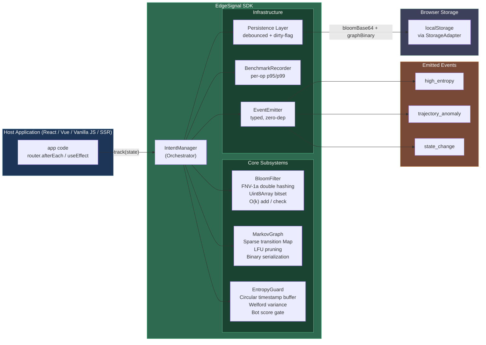
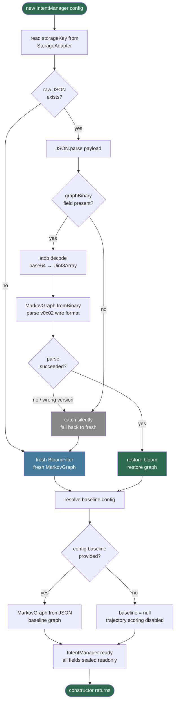

# EdgeSignal — Documentation

> **EdgeSignal** — on-device behavioral intent modeling with zero data egress.

[](https://github.com/purushpsm147/EdgeSignal-Privacy-First-Intent-Engine)
[](./LICENSE)
[](https://www.typescriptlang.org/)

A tiny, tree-shakeable TypeScript SDK that learns how a user navigates your application and fires events when behavior becomes anomalous — all without sending a single byte to a server. It works in browsers, Node.js, Deno, Bun, Edge Workers, and SSR frameworks.

---

## Table of Contents

1. [What It Is](#what-it-is)
2. [Strengths](#strengths)
3. [Known Limitations](#known-limitations)
4. [Installation](#installation)
5. [Quick Start](#quick-start)
6. [Real-World Recipes](#real-world-recipes)
   - [Dynamic Paywall](#1-dynamic-paywall)
   - [Hesitation Discount](#2-hesitation-discount)
   - [Rage-Click Healer](#3-rage-click-healer)
7. [Configuration Reference](#configuration-reference)
8. [Testing Guide](#testing-guide)
9. [Technical Deep Dive](#technical-deep-dive)
   - [Architecture Overview](#architecture-overview)
   - [Bloom Filter](#bloom-filter)
   - [Markov Graph](#markov-graph)
   - [Transition Entropy](#transition-entropy)
   - [Log-Likelihood Trajectory Analysis](#log-likelihood-trajectory-analysis)
   - [Z-Score Anomaly Gate](#z-score-anomaly-gate)
   - [EntropyGuard — Bot & Anti-Gaming Protection](#entropyguard--bot--anti-gaming-protection)
   - [Dwell-Time Anomaly Detection](#dwell-time-anomaly-detection)
   - [Selective Bigram Markov Transitions](#selective-bigram-markov-transitions)
   - [Event Cooldown](#event-cooldown)
   - [IntentManager Orchestration](#intentmanager-orchestration)
   - [Binary Serialization](#binary-serialization)
   - [LFU Pruning](#lfu-pruning)
10. [Performance](#performance)
11. [Bundle Size](#bundle-size)
12. [Privacy Claims — Verified](#privacy-claims--verified)
13. [License](#license)

---

## What It Is

The EdgeSignal SDK is a **local behavioral inference library**. As a user navigates your application, it:

1. Records state transitions (page routes, UI milestones, custom events) into a sparse **Markov graph** stored in `localStorage`.
2. Maintains a **Bloom filter** for O(1) membership tests ("has this user ever visited `/checkout`?").
3. Continuously evaluates **transition entropy** — when a user starts wandering randomly (e.g. rage-clicking back and forth), a `high_entropy` event fires.
4. Compares the live navigation trajectory against a **calibrated baseline graph** via log-likelihood scoring. Unusual paths trigger a `trajectory_anomaly` event.
5. Runs **EntropyGuard**, a timing-based bot detector, to suppress false signals from automated test runners and scrapers.
6. Tracks **dwell-time** per state and fires a `dwell_time_anomaly` event when the time spent deviates statistically from learned patterns (Welford’s online z-score, O(1) per call).
7. Optionally learns **selective bigram transitions** (`A→B` → `B→C`) for richer second-order behavioral modeling, frequency-gated to prevent state explosion.

All of this happens inside the user's browser. No analytics endpoint. No fingerprinting. No PII.

---

## Strengths

| Property | Detail |
|---|---|
| **Zero data egress** | Every computation runs on the device. Nothing leaves the browser. |
| **Tiny footprint** | Minified bundle ≈ 6 kB gzip. Bloom filter default: 256 bytes. Serialized graph: ~1.4 kB for 100 states. |
| **Sub-millisecond hot path** | `track()` averages **0.0019 ms** at steady state (p99 < 0.005 ms). |
| **SSR-safe** | All browser globals are behind `StorageAdapter` / `TimerAdapter` interfaces. Works in Next.js, Nuxt, Remix, and Cloudflare Workers without a `typeof window` guard. |
| **Isomorphic adapters** | Ship your own storage and timer implementations for testing, Redis, or any other backing store. |
| **Dirty-flag persistence** | `localStorage` writes only happen when state actually changed, eliminating jank on high-frequency routes. |
| **Bounded memory growth** | LFU pruning evicts the least-used 20 % of states when the graph exceeds `maxStates` (default: 500). |
| **Bot-resilient** | EntropyGuard detects impossibly-fast timing patterns and silently suppresses entropy/trajectory events for suspected bots, preventing discount abuse. |
| **Dwell-time anomaly** | O(1) Welford’s online z-score per state — fires `dwell_time_anomaly` when a user lingers or rushes through a page anomalously. |
| **Selective bigrams** | Optional second-order Markov transitions, frequency-gated and LFU-pruned. Only 18 bytes additional graph overhead at 50 states. |
| **Event cooldown** | Per-channel cooldown gating (`eventCooldownMs`) prevents event flooding without losing detection fidelity. |
| **Clean teardown** | `destroy()` API flushes state, cancels timers, and removes listeners for leak-free SPA lifecycle management. |
| **Fully typed** | Ships `.d.ts` declarations for every public API and event payload. |
| **Dual CJS + ESM** | `dist/index.js` (ESM) + `dist/index.cjs` (CommonJS) with source maps. |
| **Zero runtime deps** | The entire package has no external runtime dependencies. |

---

## Known Limitations

These are accepted, documented constraints — not bugs.

### 1. AUC ≈ 0.74 at low noise deltas

When the difference between a "normal" and "anomalous" trajectory is very small (Δε ≤ 0.05 noise, entropy difference < 0.05 nats), the z-score distributions of the two populations overlap substantially. This yields an AUC of approximately **0.74 at the optimal operating point**.

This is a **fundamental signal constraint**, not a tuning problem. A single-window 32-step average log-likelihood cannot fully separate distributions that close. There are two paths to improvement:

- **Longer observation windows** (> 32 steps), or
- **Richer feature space** — dwell-time anomaly detection is now built in (see [Dwell-Time Anomaly Detection](#dwell-time-anomaly-detection)). Click velocity and inter-event interval entropy remain as future enhancements (see [FUTURE_FEATURES.md](./FUTURE_FEATURES.md)).

For most product use cases (discount triggers, paywall decisions, support-chat prompts) the 0.74 AUC is sufficient. Do not use this library as the sole input in high-stakes security decisions.

### 2. Bloom filter false positives

The Bloom filter never returns false negatives, but can return false positives — it may occasionally report `hasSeen('/checkout') === true` for a state the user has not actually visited. The default configuration (2048 bits, 4 hash functions) yields a false-positive rate under 1 % for up to ~200 distinct states. Use `BloomFilter.computeOptimal(n, fpr)` to tune for your application's state count.

### 3. `localStorage` quota limits

`persist()` writes to `localStorage`. Browsers allow 5–10 MB per origin. The library's binary format keeps the payload to ~1.4 kB for 100 states, but extremely large graphs (thousands of states) can hit quota limits. Subscribe to `onError` to handle `QuotaExceededError` gracefully.

### 4. No cross-tab synchronization

The in-memory graph is not kept in sync across browser tabs. Each tab maintains its own learned state. If your application needs a unified model, flush the state server-side and provide it as a `baseline` config on initialization.

### 5. Quantization rounding

Transition probabilities stored in the binary format are quantized to 8-bit precision (`uint8`, 256 levels). The maximum rounding error per probability is ±1/255 ≈ ±0.004. This is negligible for all practical thresholds.

---

## Installation

```bash
npm install edge-signal
```

```bash
pnpm add edge-signal
```

```bash
yarn add edge-signal
```

The package ships **zero runtime dependencies**.

---

## Quick Start

```ts
import { IntentManager } from 'edge-signal';

const intent = new IntentManager({
  storageKey: 'my-app-intent',   // localStorage key
  graph: {
    highEntropyThreshold: 0.75,  // normalized entropy in [0..1]
    divergenceThreshold: 3.5,    // z-score magnitude to trigger anomaly
    maxStates: 500,              // LFU prune limit
  },
});

// Subscribe to events before tracking
intent.on('high_entropy', ({ state, normalizedEntropy }) => {
  console.log(`User is wandering at "${state}" (entropy=${normalizedEntropy.toFixed(2)})`);
});

intent.on('trajectory_anomaly', ({ zScore, expectedBaselineLogLikelihood }) => {
  console.log(`Unusual path detected (z=${zScore.toFixed(2)})`);
});

intent.on('state_change', ({ from, to }) => {
  console.log(`${from ?? 'start'} → ${to}`);
});

// Call track() on every route change or significant UI event
intent.track('/home');
intent.track('/products');
intent.track('/products/42');
intent.track('/cart');
```

### Event Payloads

```ts
// Fires when normalized entropy >= highEntropyThreshold for a state
interface HighEntropyPayload {
  state: string;
  entropy: number;           // raw Shannon entropy in nats
  normalizedEntropy: number; // [0..1], 1.0 = maximum randomness
}

// Fires when the trajectory log-likelihood diverges from baseline
interface TrajectoryAnomalyPayload {
  stateFrom: string;
  stateTo: string;
  realLogLikelihood: number;             // LL under the live graph
  expectedBaselineLogLikelihood: number; // LL under the baseline graph
  zScore: number;                        // standard deviations from baseline mean
}

// Fires when dwell time on a state deviates from the learned mean
interface DwellTimeAnomalyPayload {
  state: string;        // the state where anomalous dwell was observed
  dwellMs: number;      // actual dwell time in milliseconds
  meanMs: number;       // learned mean dwell for this state
  stdMs: number;        // learned standard deviation
  zScore: number;       // (dwellMs - mean) / std
}

// Fires on every track() call
interface StateChangePayload {
  from: string | null; // null on the first track() call
  to: string;
}
```

---

## Real-World Recipes

### 1. Dynamic Paywall

Show a soft paywall only after a user has demonstrated genuine reading intent — not on their first visit.

```ts
import { IntentManager } from 'edge-signal';

const intent = new IntentManager({ storageKey: 'editorial-intent' });

function onRouteChange(route: string) {
  intent.track(route);

  // Fire paywall after the user has visited 3+ distinct article pages.
  // hasSeen() is O(1) regardless of how many states exist.
  const articleRoutes = ['/article/1', '/article/2', '/article/3'];
  const seenCount = articleRoutes.filter(r => intent.hasSeen(r)).length;

  if (seenCount >= 3 && !intent.hasSeen('/paywall-shown')) {
    intent.track('/paywall-shown'); // Bloom filter prevents re-showing across sessions
    showPaywall();
  }
}
```

**Why this works:**

`hasSeen()` is backed by the Bloom filter — it is an O(1) constant-time operation regardless of how many states the graph has learned. The filter is persisted across sessions via `localStorage`, so a user who reads 2 articles today and 1 tomorrow still hits the gate. The `/paywall-shown` sentinel state ensures the paywall appears at most once per device, with no server-side session required.

---

### 2. Hesitation Discount

Detect genuine purchase hesitation by correlating two independent signals:

- **Spatial signal** (`trajectory_anomaly`) — the user's path diverges from how typical converters navigate.
- **Temporal signal** (`dwell_time_anomaly`) — the user is lingering statistically longer than their own previous visits to that state.

A single signal is a weak proxy. Both firing **within the same short window** is a high-confidence indicator of "I want to buy but I'm not sure." This is the same multi-signal correlation approach used in UEBA and SIEM tooling to reduce false positives.

```ts
import { IntentManager, SerializedMarkovGraph } from 'edge-signal';

// Calibrated baseline: what a converting session looks like.
// Gather this from historical analytics, then embed it here.
const checkoutBaseline: SerializedMarkovGraph = {
  states: ['/home', '/search', '/product', '/cart', '/checkout'],
  rows: [
    [0, 100, [[1, 80], [2, 20]]],     // /home → mostly /search
    [1, 80,  [[2, 75], [0, 5]]],      // /search → /product
    [2, 75,  [[3, 60], [1, 15]]],     // /product → /cart
    [3, 60,  [[4, 55], [2, 5]]],      // /cart → /checkout
  ],
  freedIndices: [],
};

const intent = new IntentManager({
  storageKey: 'shop-intent',
  baseline: checkoutBaseline,
  graph: {
    divergenceThreshold: 2.5,
    // Calibrated from your own data using scripts/scenario-matrix.mjs
    baselineMeanLL: -0.52,
    baselineStdLL: 0.18,
  },
  // Enable temporal intent detection
  dwellTime: {
    enabled: true,
    minSamples: 5,          // learn quickly within a session
    zScoreThreshold: 2.0,   // lower individual threshold — the combo gate does the heavy lifting
  },
  eventCooldownMs: 15_000,  // prevent re-triggering within 15 s at the SDK level
});

// Time-bound correlation: both signals must fire within 30 seconds of each other.
// Without this window, a trajectory anomaly on /home could pair with a dwell
// anomaly on /terms-of-service ten minutes later — a spurious combination.
let lastTrajectoryAnomaly = 0;
let lastDwellAnomaly = 0;
const CORRELATION_WINDOW_MS = 30_000; // 30 seconds

function maybeShowDiscount(): void {
  const now = Date.now();
  const isCorrelated =
    (now - lastTrajectoryAnomaly < CORRELATION_WINDOW_MS) &&
    (now - lastDwellAnomaly < CORRELATION_WINDOW_MS);

  if (isCorrelated && isNearCheckout()) {
    showHesitationDiscount('10% off — just for you. Offer expires in 10 min.');
    // Reset timestamps to prevent spamming after the discount is shown
    lastTrajectoryAnomaly = 0;
    lastDwellAnomaly = 0;
  }
}

intent.on('trajectory_anomaly', () => {
  lastTrajectoryAnomaly = Date.now();
  maybeShowDiscount();
});

intent.on('dwell_time_anomaly', ({ zScore }) => {
  // Only positive z-scores mean lingering; negative means rushing through.
  // Use a slightly relaxed threshold here (1.5) since the correlation window
  // already filters coincidental pairings.
  if (zScore > 1.5) {
    lastDwellAnomaly = Date.now();
    maybeShowDiscount();
  }
});

function isNearCheckout(): boolean {
  return intent.hasSeen('/cart') || intent.hasSeen('/checkout');
}
```

**Calibrating the baseline:**

Run `npm run test:perf:matrix` after pointing `scripts/scenario-matrix.mjs` at representative session replays from your analytics platform. It outputs the `baselineMeanLL` and `baselineStdLL` values to embed in your config.

**Why dwell-time stats are session-scoped — a privacy feature, not a limitation:**

Dwell-time statistics are held in memory only and are never persisted to `localStorage`. This is a deliberate privacy boundary. Permanently storing per-user temporal profiles (how long someone reads each page, across every visit, over months) would enable invasive behavioral fingerprinting — correlating reading speed and attention patterns to build a persistent identity. EdgeSignal intentionally keeps all temporal math strictly session-scoped. The warm-up period (`minSamples`) resets on every page load as a direct consequence of this guarantee. For checkout funnels this trade-off is acceptable, and arguably beneficial: the signal is always grounded in the current session's behaviour, not stale historical data from a different context.

---

### 3. Rage-Click Healer

Detect frantic, high-entropy navigation and surface a help prompt before the user bounces.

```ts
import { IntentManager } from 'edge-signal';

const intent = new IntentManager({
  storageKey: 'support-intent',
  graph: {
    highEntropyThreshold: 0.80, // trigger earlier for support use case
  },
});

intent.on('high_entropy', ({ state, normalizedEntropy }) => {
  if (normalizedEntropy > 0.90) {
    // Full rage-click pattern: open live chat immediately
    openLiveChat({ context: `User stuck at: ${state}` });
  } else {
    // Moderate confusion: surface a contextual tooltip or FAQ
    showContextualHelp(state);
  }
});

// Track every page view — works with any router
router.afterEach((to) => intent.track(to.path));

// Or in React
useEffect(() => {
  intent.track(location.pathname);
}, [location.pathname]);
```

---

## Configuration Reference

```ts
interface IntentManagerConfig {
  // Key written to the StorageAdapter (default: 'edge-signal')
  storageKey?: string;

  // Milliseconds between storage writes (default: 2000)
  persistDebounceMs?: number;

  // Bloom filter sizing
  bloom?: {
    bitSize?: number;    // default: 2048  (256 bytes)
    hashCount?: number;  // default: 4
  };

  // Markov graph behavior
  graph?: {
    highEntropyThreshold?: number;  // [0..1], default: 0.75
    divergenceThreshold?: number;   // z-score magnitude, default: 3.5
    baselineMeanLL?: number;        // calibrated mean avg log-likelihood
    baselineStdLL?: number;         // calibrated std dev of avg log-likelihood
    smoothingEpsilon?: number;      // Laplace epsilon, default: 0.01
    maxStates?: number;             // LFU prune cap, default: 500
  };

  // Pre-built reference graph for trajectory comparison
  baseline?: SerializedMarkovGraph;

  // Isomorphic adapters — swap out for SSR / testing
  storage?: StorageAdapter;  // default: BrowserStorageAdapter
  timer?: TimerAdapter;      // default: BrowserTimerAdapter

  // Called on QuotaExceededError / SecurityError during persist()
  onError?: (err: Error) => void;

  // EntropyGuard bot detection (default: true)
  // Set to false in Cypress / Playwright E2E environments
  botProtection?: boolean;

  // Minimum milliseconds between repeated emissions of the same event type.
  // Default: 0 (no cooldown). Set to e.g. 3000 to suppress event flooding.
  eventCooldownMs?: number;

  // Dwell-time anomaly detection settings
  // NOTE: dwell-time accumulators are session-scoped and not persisted.
  // The learning phase restarts on every page reload / new IntentManager instance.
  dwellTime?: {
    enabled?: boolean;          // default: false
    minSamples?: number;        // minimum observations before firing (default: 10)
                                // raise this value for short-session applications
    zScoreThreshold?: number;   // |z| >= this fires the event (default: 2.5)
  };

  // Selective bigram (second-order) Markov transitions
  enableBigrams?: boolean;          // default: false
  bigramFrequencyThreshold?: number; // min unigram rowTotal before recording bigrams (default: 5)

  // Built-in performance instrumentation
  benchmark?: {
    enabled?: boolean;       // default: false
    maxSamples?: number;     // default: 4096
  };
}
```

### Bloom Filter Tuning

Use the static helper to compute optimal parameters for your known state-space:

```ts
import { BloomFilter } from 'edge-signal';

const { bitSize, hashCount } = BloomFilter.computeOptimal(
  200,   // expected distinct states
  0.01,  // target false-positive rate (1 %)
);
// → { bitSize: 1918, hashCount: 7 }

const intent = new IntentManager({ bloom: { bitSize, hashCount } });

// Estimate current FPR after N insertions
const filter = new BloomFilter({ bitSize, hashCount });
filter.estimateCurrentFPR(150); // → ~0.004 (0.4 %)
```

### Custom Adapters (SSR / Testing)

```ts
import {
  IntentManager,
  MemoryStorageAdapter,
} from 'edge-signal';

// Server-side rendering — no localStorage access, no persistence
const intent = new IntentManager({
  storage: new MemoryStorageAdapter(),
  botProtection: false,
});

// Controllable clock for deterministic timing tests
class FakeTimerAdapter {
  private _now = 1000;
  tick(ms: number) { this._now += ms; }
  now() { return this._now; }
  setTimeout(fn: () => void, ms: number) { return setTimeout(fn, ms); }
  clearTimeout(id: ReturnType<typeof setTimeout>) { clearTimeout(id); }
}
const fakeTimer = new FakeTimerAdapter();
const testIntent = new IntentManager({
  storage: new MemoryStorageAdapter(),
  timer: fakeTimer,
  botProtection: false,
});
```

---

## Testing Guide

### Unit Tests

```bash
npm run build:tsc    # compile TypeScript to dist/
npm test             # runs Node.js built-in test runner (no extra deps)
```

The suite in `tests/intent-sdk.test.mjs` covers:

- Bloom filter add / check / false-positive properties
- `computeOptimal` and `estimateCurrentFPR` math
- Markov graph transitions, `getProbability`, entropy, log-likelihood
- Binary serialization round-trips (version `0x02`)
- Tombstone / LFU pruning correctness
- `IntentManager` event firing, dirty-flag persistence, session reset
- EntropyGuard suppression with injectable `FakeTimerAdapter`

### Performance Regression Tests

```bash
npm run test:perf:run      # run benchmarks → benchmarks/latest.json
npm run test:perf:assert   # compare latest.json vs benchmarks/baseline.json
```

If `avgTrackMs` in `latest.json` regresses beyond the threshold defined in `scripts/perf-regression.mjs`, the assert step exits non-zero — making it CI-safe as a required check.

To update the baseline after a deliberate performance improvement:

```bash
npm run test:perf:update-baseline
```

### Scenario Matrix (Golden File)

```bash
npm run test:perf:matrix                    # assert against golden
npm run test:perf:update-matrix-golden      # regenerate golden file
```

`benchmarks/evaluation-matrix.golden.json` captures expected `high_entropy` and `trajectory_anomaly` trigger counts for scripted navigation scenarios. Any code change that alters detection behavior will fail this gate.

### ROC Experiment

```bash
npm run test:perf:roc
```

Produces `benchmarks/roc-experiment.json` with AUC and best-threshold data for the trajectory anomaly detector across a spectrum of noise deltas. Use this to validate proposed improvements to the scoring algorithm before shipping.

### E2E Tests (Cypress)

```bash
npm run test:e2e                  # headless Chrome
npm run test:e2e:headed           # visible Chrome (useful for debugging)
npx cypress run --spec "cypress/e2e/intent.cy.ts"
npx cypress open                  # interactive runner
```

E2E tests launch the sandbox app (`sandbox/index.html`) and verify that toast notifications appear when `high_entropy` and `trajectory_anomaly` events fire.

> **Critical:** Always initialize `IntentManager` with `botProtection: false` inside your E2E harness. Cypress fires `track()` calls faster than any human, which would trigger EntropyGuard and suppress all events, causing every assertion to fail.

---

## Technical Deep Dive

### Architecture Overview

#### High-Level Design — Component Map



| Component | Role | Key constraint |
|---|---|---|
| **IntentManager** | Single public orchestrator — routes every `track()` call through all subsystems | `readonly` fields prevent accidental mutation; never throws |
| **BloomFilter** | Probabilistic set membership for `hasSeen()` | Fixed-size `Uint8Array`; O(k) per operation regardless of state count |
| **MarkovGraph** | Sparse first-order Markov chain; learns transition counts in real time | State labels interned to `uint16` indices; max 65 535 states |
| **EntropyGuard** | Bot / automation detector based on inter-call timing | Fixed-size circular buffer; zero heap allocations in hot path |
| **DwellTimeDetector** | Per-state dwell-time anomaly detection via Welford's online algorithm | O(1) per call; Map of `[count, mean, m2]` tuples |
| **Bigram Recorder** | Selective second-order Markov transitions (`A→B` → `B→C`) | Frequency-gated; shares graph with LFU pruning under `maxStates` |
| **EventEmitter** | Typed mini event bus: `high_entropy`, `trajectory_anomaly`, `dwell_time_anomaly`, `state_change` | ~20 lines; no `EventTarget` dependency for SSR safety; per-channel cooldown applies to anomaly events only (`high_entropy`, `trajectory_anomaly`, `dwell_time_anomaly`); `state_change` is always emitted immediately |
| **BenchmarkRecorder** | Optional per-operation p95/p99 latency sampler | Disabled by default; ring-buffer avoids unbounded growth |
| **Persistence Layer** | Debounced, dirty-flag-gated `localStorage` write | Writes only on actual state change; binary format, not JSON |
| **StorageAdapter / TimerAdapter** | Isomorphic interfaces wrapping `localStorage` and `setTimeout` | Swap for `MemoryStorageAdapter` in SSR / tests |

---

#### Initialization Flow — `new IntentManager(config)`



**Key behavior:** if the stored binary blob is absent, corrupt, or has an unrecognized version byte, the error is swallowed and a brand-new graph is used. First-run and corrupted-storage are indistinguishable to the caller — the SDK never surfaces a startup error.

---

#### Hot-Path Flow — `track(state)`


The critical invariants visible in this flow:

- **EntropyGuard runs unconditionally** before all signal evaluation — bot classification happens even on the very first `track()` call.
- **Bloom add always runs** regardless of bot status — the filter and graph continue learning even for suspected bots. Only event *emission* is suppressed.
- **`isDirty` is set in two places** — new Bloom state and new graph transition are tracked independently so the persistence gate captures both.
- **Dwell-time evaluation runs before trajectory push** — the dwell on the *previous* state is measured before the new state enters the window, ensuring the measurement reflects actual time on the departing state.
- **Bigram recording is frequency-gated** — `graph.rowTotal(from) >= bigramFrequencyThreshold` prevents state explosion from rare transitions.
- **Entropy is gated at `rowTotal ≥ 10`** — prevents spurious `high_entropy` events on states with only 2–3 recorded transitions.
- **Trajectory evaluation needs both a warm window (≥ 16) and a baseline** — neither is sufficient alone.
- **Event cooldown is per-channel** — `high_entropy`, `trajectory_anomaly`, and `dwell_time_anomaly` each track their own last-emitted timestamp independently.

---

#### Persistence Flow — `persist()`


**Pruning happens here, not in `track()`** — the hot path is never blocked by O(S+E) pruning work. The cost is paid once per debounce flush when the state cap is exceeded.

All six sub-operations are individually timed when `benchmark: { enabled: true }` is set. Percentile stats (p95, p99, max) are exposed via `getPerformanceReport()`.

---

### Bloom Filter

A Bloom filter is a space-efficient probabilistic set. It answers "have I seen this element?" in O(k) time using O(m/8) bytes of space, where k is the number of hash functions and m is the bit-array width.

**Insertion — double hashing:**

Two FNV-1a seeds produce base hashes $h_1$ and $h_2$. All $k$ bit positions are derived without computing $k$ independent hash functions:

$$
\text{for } i = 0 \ldots k-1: \quad \text{bits}\left[(h_1 + i \cdot h_2) \bmod m\right] \leftarrow 1
$$

FNV-1a is branchless, cache-friendly, and produces identical results across all JavaScript engines — a prerequisite for correct cross-session filter restoration.

**Query:**

Return `true` only when all $k$ derived bits are set. A single zero bit is a definitive negative.

**False-positive rate:**

The probability that a never-inserted item passes all $k$ bit checks after $n$ insertions:

$$
\text{FPR} \approx \left(1 - e^{-kn/m}\right)^k
$$

**Optimal parameter formulas:**

$$
m = \left\lceil \frac{-n \ln p}{(\ln 2)^2} \right\rceil \qquad\qquad k = \left\lfloor \frac{m}{n} \ln 2 \right\rfloor
$$

`BloomFilter.computeOptimal(n, p)` implements these formulas exactly. `estimateCurrentFPR(n)` computes the live FPR approximation.

**Storage:** The default 2048-bit filter occupies **256 bytes**. It is serialized to base64 (344 ASCII characters) for `localStorage`.

---

### Markov Graph

A first-order Markov chain models the conditional probability of a next state given the current one:

$$
P(s_{t+1} = j \mid s_t = i) = \frac{c(i \to j)}{\displaystyle\sum_k c(i \to k)}
$$

where $c(i \to j)$ is the count of observed transitions from state $i$ to state $j$.

**Sparse storage:**

Only observed transitions are stored. The internal structure is:

```
Map<fromIndex: number, {
  total: number,
  toCounts: Map<toIndex: number, count: number>
}>
```

State labels are interned to integer indices, so all graph operations compare integers rather than strings. Memory scales with **observed transitions**, not the Cartesian product of all possible states.

- `incrementTransition(from, to)` — O(1) amortized
- `getProbability(from, to)` — O(1)
- `entropyForState(state)` — O(k) where k = number of outgoing edges

**Quantized export:**

For the binary wire format, probabilities are quantized to 8 bits:

$$
q = \lfloor p \times 255 \rceil \;\&\; \texttt{0xff} \qquad p' = q / 255
$$

Maximum rounding error per edge: $\pm 1/255 \approx \pm 0.004$.

---

### Transition Entropy

Entropy measures the unpredictability of a user's next move from a given state.

**Shannon entropy (nats):**

$$
H(i) = -\sum_{j} P(i \to j) \ln P(i \to j)
$$

**Normalized entropy** — maps into $[0, 1]$ by dividing by the theoretical maximum (uniform distribution over $k$ outgoing edges):

$$
\hat{H}(i) = \frac{H(i)}{\ln k}
$$

Interpretation:

| $\hat{H}(i)$ | Meaning |
|---|---|
| 0 | User always transitions to the same next state |
| 0.5 | Moderate spread; some preferred paths exist |
| 1.0 | Completely random; user transitions with equal probability to all neighbors |

The `high_entropy` event fires when $\hat{H}(i) \geq \theta_\text{entropy}$ (default 0.75) **and** the state has at least `MIN_SAMPLE_TRANSITIONS` (10) observed outgoing transitions. The minimum-sample guard prevents spurious triggers on newly-seen states with only 2–3 transitions recorded.

---

### Log-Likelihood Trajectory Analysis

Given a session trajectory $[s_0, s_1, \ldots, s_T]$, the **average log-likelihood** under a reference graph $G_\text{baseline}$ is:

$$
\bar{\ell} = \frac{1}{T} \sum_{t=0}^{T-1} \ln P_\text{baseline}(s_{t+1} \mid s_t)
$$

When a transition has zero probability in the baseline, **Laplace (epsilon) smoothing** prevents $-\infty$:

$$
P_\text{smoothed}(j \mid i) = \max\left(P_\text{baseline}(j \mid i),\ \varepsilon\right) \qquad \varepsilon = 0.01
$$

The library maintains a **sliding window** of states of length 16–32 (`MIN_WINDOW_LENGTH` to `MAX_WINDOW_LENGTH`). The window size is enforced by shifting the oldest element when length exceeds 32.

**Why evaluate against the baseline, not the live graph?**

The live graph is learned from the current session — it always assigns high probability to paths it has already seen. The meaningful question is: *does this user's path look unusual under the known-good baseline?* Comparing session behavior against a pre-calibrated reference avoids circular self-reinforcement.

---

### Z-Score Anomaly Gate

Raw log-likelihood values depend on trajectory length, making absolute threshold tuning fragile. When calibration data is available, the library normalizes via z-score:

$$
z = \frac{\bar{\ell} - \mu_\text{baseline}}{\sigma_\text{baseline} \cdot \sqrt{N_\text{calibration} / N}}
$$

The $\sqrt{N_\text{calibration}/N}$ factor is **dynamic variance scaling**: the standard deviation of a sample mean scales as $\sigma / \sqrt{N}$. Shorter windows produce noisier estimates and are therefore penalized less aggressively.

The `trajectory_anomaly` event fires when:

$$
z \leq -|\theta_\text{divergence}|
$$

Default $\theta_\text{divergence} = 3.5$ standard deviations below the baseline mean.

**Without calibration:** If `baselineMeanLL` / `baselineStdLL` are not provided, the library falls back to comparing the raw `expectedAvg` against `-|divergenceThreshold|` directly. This is less precise but functional for bootstrapping.

**Calibration workflow:**

```bash
npm run test:perf:matrix   # generates evaluation-matrix.json
# Extract baselineMeanLL and baselineStdLL from the output
# Embed them in your IntentManagerConfig
```

---

### EntropyGuard — Bot & Anti-Gaming Protection

EntropyGuard prevents two threat vectors:

1. **Automated scrapers / bots** triggering discount or paywall events by navigating at machine speed.
2. **Intentional gaming** — a user rapidly cycling through states to force discount delivery.

**Data structure:** A fixed-size circular buffer of 10 `performance.now()` timestamps. No allocations occur in the hot path — the buffer is pre-allocated on construction.

**Scoring algorithm (re-evaluated on every `track()` call):**

```
windowBotScore = 0

For each consecutive pair of timestamps:
  delta = timestamps[i+1] - timestamps[i]
  if delta < 50ms:          → windowBotScore += 1  (impossibly fast)

If deltaCount >= 3:
  variance = Σ(δᵢ - δ̄)² / N   (Welford's online algorithm)
  if variance < 100ms²:     → windowBotScore += 1  (robotic regularity)

isSuspectedBot = windowBotScore >= 5
```

**Welford's online algorithm** is used for variance to avoid a two-pass computation and for numerical stability with floating-point arithmetic.

**Recovery:** Because the score is derived fresh from the circular buffer contents on every evaluation, old bot-like timestamps age out naturally as human-paced interactions fill the buffer. There is no permanent ban, no explicit reset method, and no timer — the flag clears itself through normal usage.

**Configuration:**

```ts
// Production (default) — protection on
const intent = new IntentManager({ storageKey: 'app' });

// E2E / CI — must disable; Cypress clicks are sub-10ms
const intent = new IntentManager({
  storageKey: 'app',
  botProtection: false,
});
```

---

### IntentManager Orchestration

`IntentManager` is the single orchestration class consumers interact with.

| Concern | Implementation |
|---|---|
| State machine | `previousState: string \| null` field; `recentTrajectory: string[]` sliding window |
| Bloom | `BloomFilter` instance, hydrated from `localStorage` on construction |
| Graph | `MarkovGraph` instance, hydrated from binary `localStorage` blob on construction |
| Baseline | Second `MarkovGraph` deserialized from `config.baseline` JSON at construction |
| Events | Internal `EventEmitter<IntentEventMap>` — 20 lines, zero external deps |
| Persistence | Debounced write (2 s default), dirty-flag guards every write |
| Bot detection | `EntropyGuard` circular buffer, synchronized to `timer.now()` |
| Dwell-time | Welford’s online accumulator per state; z-score anomaly detection |
| Bigrams | Selective second-order Markov transitions, frequency-gated |
| Event cooldown | Per-channel cooldown gating via `eventCooldownMs` |
| Benchmarking | `BenchmarkRecorder` with per-operation ring-buffer sample accumulators |
| Error handling | All `try/catch` blocks route to `onError?: (err: Error) => void`; never throws |

**Session reset:**

```ts
// Clears recentTrajectory and previousState without touching the learned graph.
// Use before evaluating a new user intent session on a single-page app.
intent.resetSession();
```

**Force flush:**

```ts
// Cancels the debounce timer and writes to storage immediately.
// Use before page unload or during cleanup.
intent.flushNow();
```

**Teardown:**

```ts
// Flush pending state, cancel timers, remove all event listeners.
// Call in SPA cleanup paths (React useEffect teardown, Vue onUnmounted, Angular ngOnDestroy).
intent.destroy();
```

---

### Dwell-Time Anomaly Detection

The dwell-time feature channel measures how long a user stays on each state before transitioning. It uses **Welford’s online algorithm** to maintain running mean and variance per state with O(1) time and O(1) space per update — no arrays or sorting.

**Algorithm:**

For each state $s$, maintain a Welford accumulator $(n, \bar{x}, M_2)$:

$$
\delta = x - \bar{x} \qquad \bar{x} \mathrel{+}= \delta / n \qquad M_2 \mathrel{+}= \delta \cdot (x - \bar{x})
$$

Population standard deviation: $\sigma = \sqrt{M_2 / n}$

Z-score: $z = (x - \bar{x}) / \sigma$

The `dwell_time_anomaly` event fires when:
- At least `minSamples` (default: 10) dwell observations have been recorded for the state
- $|z| \geq$ `zScoreThreshold` (default: 2.5)
- The session is not flagged as bot-suspected
- The event cooldown window has elapsed (if `eventCooldownMs > 0`)

**Configuration:**

```ts
const intent = new IntentManager({
  dwellTime: {
    enabled: true,
    minSamples: 10,      // wait for statistical significance
    zScoreThreshold: 2.5, // ~1.2% two-tailed under normal distribution
  },
});

intent.on('dwell_time_anomaly', ({ state, dwellMs, meanMs, stdMs, zScore }) => {
  console.log(`Unusual dwell on "${state}": ${dwellMs}ms (mean=${meanMs.toFixed(0)}ms, z=${zScore.toFixed(2)})`);
});
```

**Complements EntropyGuard:** EntropyGuard detects bots via timing regularity across states. Dwell-time detection catches anomalies within individual states — a user who normally spends 5s on `/product` but suddenly spends 45s, or rushes through in 200ms.

**Session scope (intentional):** Dwell-time accumulators (`dwellStats`) are **not persisted to storage across page reloads**. This is a deliberate privacy decision: per-state timing distributions are more sensitive than transition counts and would meaningfully expand the cross-session fingerprinting surface area — directly contrary to the library's local-only design goal. As a result, the learning phase governed by `minSamples` restarts on every new `IntentManager` instance. If your application reloads frequently and you observe excessive false-positive `dwell_time_anomaly` events early in a session, raise `minSamples` (e.g. to 20–30) to require a more solid statistical baseline before the detector activates.

---

### Selective Bigram Markov Transitions

Standard first-order Markov chains model $P(s_{t+1} | s_t)$. Bigrams extend this to second-order: $P(s_{t+1} | s_{t-1}, s_t)$.

**Problem:** For $N$ states, first-order has $N^2$ potential edges. Second-order has $N^3$ — 50 pages would mean 125,000 potential bigram edges. This is unacceptable for a client-side library.

**Solution — selective recording:**

Bigram transitions are only recorded when the unigram from-state has accumulated at least `bigramFrequencyThreshold` (default: 5) total outgoing transitions. This ensures only statistically meaningful states generate second-order data.

**Encoding:** Bigram states are encoded as `"prev→current"` strings (using the Unicode arrow `\u2192`). They share the same `MarkovGraph` with unigram states, inheriting LFU pruning under `maxStates`.

**Example recording logic:**

Given trajectory `[A, B, C]`, when `B` is the current from-state:
- Unigram transition: `B → C` (always recorded)
- Bigram transition: `A→B` → `B→C` (recorded only if `graph.rowTotal('B') >= bigramFrequencyThreshold`)

**Memory impact:** At 50 states with default settings, benchmarks show only **18 bytes** of additional serialized graph overhead. LFU pruning naturally evicts low-frequency bigram states before they accumulate.

**Configuration:**

```ts
const intent = new IntentManager({
  enableBigrams: true,
  bigramFrequencyThreshold: 5,  // require 5+ unigram transitions before recording bigrams
  graph: { maxStates: 500 },    // bigram states share this cap
});
```

---

### Event Cooldown

When `eventCooldownMs` is set (default: 0 = disabled), repeated emissions of the same event type are suppressed within the cooldown window. Each event channel (`high_entropy`, `trajectory_anomaly`, `dwell_time_anomaly`) tracks its own last-emitted timestamp independently.

This prevents downstream event handlers from being overwhelmed during rapid navigation bursts while preserving the first detection signal.

```ts
const intent = new IntentManager({
  eventCooldownMs: 3000, // at most one event of each type per 3 seconds
});
```

---

### Binary Serialization

The Markov graph is persisted in a custom binary format (`version 0x02`), not as JSON. This avoids `JSON.stringify` on potentially large objects and reduces storage size.

**Wire layout (all words little-endian):**

```
┌─────────────────────────────────────────┐
│ Version           : Uint8   (1 B)       │  always 0x02
│ NumStates         : Uint16  (2 B)       │
│                                         │
│   For each state:                       │
│     UTF-8 byte length : Uint16  (2 B)   │  0 for tombstone slots
│     UTF-8 bytes       : [N B]           │
│                                         │
│ NumFreedIndices   : Uint16  (2 B)       │
│   For each freed index:                 │
│     SlotIndex : Uint16  (2 B)           │
│                                         │
│ NumRows           : Uint16  (2 B)       │
│   For each row:                         │
│     FromIndex  : Uint16  (2 B)          │
│     Total      : Uint32  (4 B)          │
│     NumEdges   : Uint16  (2 B)          │
│     For each edge:                      │
│       ToIndex : Uint16  (2 B)           │
│       Count   : Uint32  (4 B)           │
└─────────────────────────────────────────┘
```

Key properties:
- **Single-allocation encode:** total buffer size is computed before any writes; `new Uint8Array(totalSize)` is called exactly once.
- Supports **up to 65,535 distinct states** (Uint16 index space) without format changes.
- Supports **up to 4,294,967,295 transitions per row** (Uint32 count).
- **Tombstone-safe:** freed slot indices are explicitly listed so `fromBinary` reconstructs the freelist without scanning labels.
- Base64-encoded for `localStorage`. Resulting string is typically **30–50 % smaller** than the equivalent `JSON.stringify` output.

---

### LFU Pruning

When `stateToIndex.size > maxStates`, `prune()` runs before every `persist()` call:

1. **Rank** all live states by total outgoing transitions (ascending — least-used first).
2. **Evict** the bottom 20 %, capped so the surviving count equals exactly `maxStates`.
3. **Clean up:**
   - Delete evicted states' outgoing rows from `this.rows`.
   - Scan all surviving rows and remove inbound edges pointing to evicted indices.
   - Set pruned slots in `indexToState[]` to `''` (the tombstone sentinel).
   - Remove them from `stateToIndex`.
   - Push their indices onto `freedIndices` for slot reuse.

Complexity: $O(S + E)$ where $S$ = state count and $E$ = total edge count.

Tombstoned slots are **reused** on the next `ensureState()` call, preventing the index array from growing unboundedly across prune cycles.

---

## Performance

Benchmarks run on **Node.js v24.1.0**, default configuration (2048-bit Bloom filter, 500-state graph cap, dwell-time and bigram features active).

| Metric | Value |
|---|---|
| `track()` average latency | **0.0020 ms** |
| `track()` p95 latency | 0.0028 ms |
| `track()` p99 latency | 0.0045 ms |
| Process RSS (Node.js hot) | ~29 MB (engine overhead dominates; SDK adds < 1 MB) |
| Serialized graph — 50 states | **1,409 bytes** (incl. bigram metadata) |
| Bloom bitset — default config | **256 bytes** |

**Impact of new features (dwell-time + selective bigrams):**

| Metric | Before | After | Delta |
|---|---|---|---|
| `avgTrackMs` | 0.0019 ms | 0.0020 ms | +5% (within noise) |
| `serializedGraphSizeBytes` | 1,391 B | 1,409 B | +18 bytes |
| Perf regression gate | — | **PASSED** | — |
| Scenario matrix (F1) | 1.000 | **1.000** | No change |
| ROC AUC @Δ0.05 | 0.739 | **0.739** | No change |
| ROC AUC @Δ0.30 | 0.999 | **0.999** | No change |

Enable the built-in profiler for per-operation breakdowns:

```ts
const intent = new IntentManager({
  benchmark: { enabled: true, maxSamples: 4096 },
});

// ... exercise your app ...

const report = intent.getPerformanceReport();
// report.track        → { count, avgMs, p95Ms, p99Ms, maxMs }
// report.bloomAdd     → { count, avgMs, p95Ms, p99Ms, maxMs }
// report.bloomCheck   → { count, avgMs, p95Ms, p99Ms, maxMs }
// report.entropyComputation   → { ... }
// report.divergenceComputation → { ... }
// report.memoryFootprint → { stateCount, totalTransitions, bloomBitsetBytes, serializedGraphBytes }
console.table(report);
```

Run the benchmark suite yourself:

```bash
npm run test:perf:run     # writes benchmarks/latest.json
npm run test:perf:assert  # fails if avgTrackMs regressed
npm run test:perf:roc     # generates AUC curve data
```

---

## Bundle Size

Built with `tsup`, targeting ES2020, minified, `sideEffects: false` for full tree-shaking.

```
dist/index.js     — ESM, minified, source map included
dist/index.cjs    — CommonJS, minified, source map included
dist/index.d.ts   — TypeScript declaration file
```

The entire SDK — `IntentManager`, `MarkovGraph`, `BloomFilter`, adapters, and the event emitter — fits comfortably under **6 kB gzip**. There are zero runtime dependencies.

If you only use `BloomFilter` and `MarkovGraph` directly (no `IntentManager`), tree-shaking will drop the orchestration layer, the event emitter, adapters, and benchmark recorder — bringing the footprint below 3 kB gzip.

---

## Privacy Claims — Verified

The privacy properties of this library are not marketing copy. Here is how each claim is enforced and verifiable:

| Claim | Verification |
|---|---|
| **No network calls** | `grep -r "fetch\|XMLHttpRequest\|sendBeacon\|WebSocket" src/` returns zero results. The `package.json` has no runtime dependencies. The minified bundle can be audited in `dist/index.js`. |
| **No fingerprinting** | No access to `navigator`, `screen`, `canvas`, `AudioContext`, or any known fingerprinting surface. EntropyGuard uses only `performance.now()` deltas from your own explicit `track()` calls. |
| **No PII** | `track()` accepts a `string` label chosen entirely by the application. The library never reads cookies, URL query parameters, form fields, local storage keys other than `storageKey`, or any DOM content. |
| **Local storage only** | Persistence routes exclusively through the `StorageAdapter` interface, which defaults to `window.localStorage`. Inspect the stored state at any time: `localStorage.getItem('edge-signal')`. |
| **Transparent & auditable** | `src/` is the exact code that ships. `tsup` minifies but does not inject code. Source maps in `dist/` make the minified output human-readable. |
| **User can clear state** | `localStorage.removeItem('edge-signal')` wipes all learned state. No server-side copy exists. |

---

## License

This project is licensed under **AGPL-3.0-only**.

```
Copyright (c) 2026 Purushottam <purushpsm147@yahoo.co.in>
```

The AGPL-3.0 requires that if you distribute software incorporating this library — including running it as a network service — you must make the **complete source code** of your application available under the same license.

**What this means in practice:**

| Use case | Obligation |
|---|---|
| Open-source projects | Free to use, modify, and distribute under AGPL-3.0 |
| Internal company tooling (not distributed) | No copyleft obligation triggered |
| Commercial SaaS / products served to end-users | Must provide source access, or obtain a commercial license |

To obtain a commercial license that removes the copyleft requirement, contact the author at **purushpsm147@yahoo.co.in**.

For the authoritative license text, see [LICENSE](./LICENSE).

---

*Built by [Purushottam](https://github.com/purushpsm147). Contributions welcome — see [CONTRIBUTING.md](./CONTRIBUTING.md). Security disclosures — see [SECURITY.md](./SECURITY.md).*
